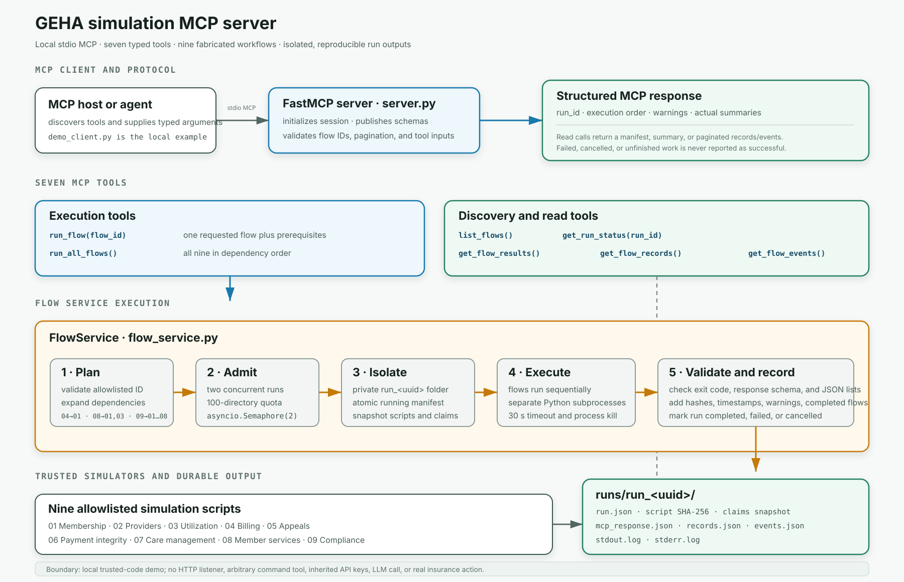

# GEHA simulations and MCP server

## Architecture



The MCP host communicates with `server.py` over stdio. FastMCP exposes nine
typed tools: seven simulation tools and two read-only policy RAG tools.
`FlowService` plans dependencies, admits at most two runs, snapshots allowlisted
inputs into a private run directory, executes simulators, validates outputs,
and returns structured results. `PolicyService` reuses the existing policy
index to retrieve citation metadata and full source tables.

This directory contains one local Model Context Protocol (MCP) server. Its nine
Python health-insurance workflow simulators are grouped under
`../highlevel_simulation/` and exposed as tools by the server.

**The MCP interface is real; the insurance operations are simulated.** The
policy tools retrieve indexed reference documents, not live claims or member
data. The server makes no coverage or medical-necessity determination and does
not call an LLM or require an API key. Policy search requires the existing
PostgreSQL/pgvector index; simulations do not.

## Quick start

Requirements: Python 3.11+ and `uv`. These instructions target the current MacBook
installation; process-group handling in the runner assumes a POSIX platform.

```bash
cd /Users/dc/geha/MCP_server
uv sync --locked
```

Discover tools without running simulations:

```bash
uv run --locked demo_client.py
```

Run all nine through a real MCP client/server connection:

```bash
uv run --locked demo_client.py --run-all
```

The demo client starts the server, initializes an MCP session, calls the tool,
prints the structured result, and disconnects. A simulation run returns a unique
`run_id` and saves its results under `runs/`. Original datasets remain unchanged.

### Start the server for an MCP host

```bash
uv run --locked server.py
```

The server waits for MCP messages on stdin. It is **not** a webpage or an
interactive terminal menu; appearing to wait is normal. Normally your MCP host
launches it automatically. Simulator console logs are captured separately so
they do not corrupt protocol messages on stdout.

Use [mcp_config.example.json](mcp_config.example.json) with clients supporting
the `mcpServers` configuration format. It points to the local `.venv/bin/python`
and `server.py` using absolute paths. Adapt it to the host's configuration schema;
this project does not automatically register itself with any agent application.
After the client initializes, it discovers the tool schemas via MCP `tools/list`.
See [README_MCP.md](README_MCP.md) for policy-index setup and example calls.

## How the pieces work together

1. A user asks an agent to perform a simulation or inspect results.
2. The agent's MCP client calls a tool such as `run_flow` with `{"flow_id":"04"}`.
3. `server.py` validates the tool arguments and delegates to `flow_service.py`.
4. The runner creates an isolated directory, snapshots allowlisted scripts and
   needed claims data, and runs prerequisites followed by the requested simulator.
5. The simulator writes detailed JSON records, events, and `mcp_response.json`.
6. The runner checks exit status and outputs, adds run metadata, and returns a
   structured tool result to the agent.

The simulator is the code behind a tool, not an LLM agent. One MCP server handles
all nine flows; there is no need for one server or container per directory.

## Directory contents

| File or directory | Purpose |
|---|---|
| `../highlevel_simulation/` | Nine simulator directories, direct-run tooling, simulation tests, documentation, and diagrams. |
| [server.py](server.py) | Registers nine MCP tools and starts the local stdio server. |
| [flow_service.py](flow_service.py) | Allowlist, dependencies, isolated execution, timeouts, validation, provenance, and result retrieval. |
| [policy_service.py](policy_service.py) | Read-only adapter to the existing parent-child policy RAG index. |
| [demo_client.py](demo_client.py) | Minimal MCP client for discovery or an end-to-end run. |
| [run_all_flows.sh](../highlevel_simulation/run_all_flows.sh) | Runs the nine scripts directly, without MCP isolation. |
| [mcp_config.example.json](mcp_config.example.json) | Example host connection configuration. |
| [pyproject.toml](pyproject.toml), [uv.lock](uv.lock) | Python requirements and locked dependencies; uses the official MCP Python SDK v1 line. |
| `.venv/` | Local Python environment created by `uv sync`. |
| `runs/` | Isolated MCP run directories, including manifests and captured logs. |
| [test_responses.py](../highlevel_simulation/test_responses.py) | Checks that all nine response summaries match generated data. |
| [test_server.py](test_server.py) | Runner safeguards and actual stdio MCP protocol tests. |
| [test_policy_service.py](test_policy_service.py) | Policy search routing, citation, and input-validation tests. |
| [README_FLOWS.md](../highlevel_simulation/README_FLOWS.md) | Detailed simulation overview, outputs, and workflow diagrams. |
| [README_MCP.md](README_MCP.md) | Detailed MCP behavior, safeguards, configuration, and limitations. |
| `../highlevel_simulation/geha_services_flowchart.png`, `../highlevel_simulation/geha_run_order.png`, `../highlevel_simulation/geha_hipaa_overlay.png` | Supporting diagrams embedded in `README_FLOWS.md`. |
| `.gitignore` | Excludes environments, Python caches, and generated run directories. |

## The nine simulations

Each folder contains `functional_spec.md`, a `simulate_*.py` program, detailed
JSON output files, and `mcp_response.json`. Specifications describe intended
workflows; not every described feature is implemented by the simplified code.

| ID / folder | Program and behavior | Detailed outputs |
|---|---|---|
| `01_membership_benefits` | [simulate_membership.py](../highlevel_simulation/01_membership_benefits/simulate_membership.py): creates fabricated members, assigns plans/dependents, simulates coverage changes, and logs ID-card issuance. | `members.json`, `membership_events.json` |
| `02_provider_operations` | [simulate_providers.py](../highlevel_simulation/02_provider_operations/simulate_providers.py): checks fabricated exclusion and credentialing flags, then assigns network status and facilities. | `providers.json`, `provider_events.json` |
| `03_utilization_management` | [simulate_utilization.py](../highlevel_simulation/03_utilization_management/simulate_utilization.py): uses fixed procedure requirements and fabricated necessity scores to simulate authorization decisions. | `authorizations.json`, `um_events.json` |
| `04_premium_billing` | [simulate_premium_billing.py](../highlevel_simulation/04_premium_billing/simulate_premium_billing.py): reads members, calculates simulated premium shares, and assigns payment statuses. | `premium_ledger.json`, `billing_events.json` |
| `05_appeals_disputes` | [simulate_appeals.py](../highlevel_simulation/05_appeals_disputes/simulate_appeals.py): processes predefined disputes through simulated deadlines, internal decisions, and external review. | `appeals.json`, `appeals_events.json` |
| `06_payment_integrity` | [simulate_payment_integrity.py](../highlevel_simulation/06_payment_integrity/simulate_payment_integrity.py): scores injected billing flags, diagnosis/procedure pairs, and charge thresholds. | `screening_log.json`, `integrity_events.json` |
| `07_care_case_management` | [simulate_care_management.py](../highlevel_simulation/07_care_case_management/simulate_care_management.py): assigns care programs and simulated enrollment/monitoring outcomes. | `care_cases.json`, `care_events.json` |
| `08_member_services` | [simulate_member_services.py](../highlevel_simulation/08_member_services/simulate_member_services.py): looks up claim, membership, and authorization statuses; some other replies are canned. | `inquiries.json`, `service_events.json` |
| `09_compliance` | [simulate_compliance.py](../highlevel_simulation/09_compliance/simulate_compliance.py): primarily checks upstream evidence-file existence and emits simulated compliance statuses. | `compliance_register.json`, `compliance_events.json` |

## MCP server methods

These are tool names exposed by `server.py`. They are invoked by an MCP client,
not by typing their names into the server terminal.

| Tool | Arguments | Result / side effects |
|---|---|---|
| `list_flows()` | None | Read-only list of flow IDs, dependencies, and output filenames. |
| `run_flow(flow_id)` | String `"01"` through `"09"` | Creates a new run, executes the selected flow and prerequisites, returns its summary and `run_id`. |
| `run_all_flows()` | None | Creates a new run and executes all nine sequentially; returns all summaries. |
| `get_flow_results(flow_id, run_id)` | Flow ID and returned run ID | Reads the selected flow's completed summary. |
| `get_flow_records(flow_id, run_id, offset=0, limit=50)` | Optional pagination | Reads detailed result records. |
| `get_flow_events(flow_id, run_id, offset=0, limit=50)` | Optional pagination | Reads event-log records. |
| `get_run_status(run_id)` | Run ID | Reads the manifest, including status, warnings, input provenance, and failure information. |

Pagination requires `offset >= 0` and `1 <= limit <= 100`. A `next_offset` of
`null` means there are no more records. Result reads require an explicit run ID;
they never silently substitute a latest result or an illustrative example.

### Dependencies and claims input

- `04` reruns `01` first.
- `08` reruns `01` and `03` first.
- `09` reruns all flows `01` through `08` first.
- `run_all_flows` runs each flow once, in numerical order.

Claims-dependent runs snapshot the existing external audit file:

`/Users/dc/geha/demo_data/audit_trails.json`

The claims adjudication engine is separate and is **not** rerun by these tools.
Missing claims data produces a warning; malformed data fails the run. The copied
snapshot and script hashes are recorded in the run manifest.

Operators can override `GEHA_CLAIMS_PATH` and `GEHA_RUNS_DIR` in the server's
environment. These are not caller-supplied tool arguments.

## Understanding the output

```text
runs/run_<32-hex-uuid>/
  run.json
  claims/audit_trails.json       # only when needed and available
  01_membership_benefits/
    simulate_membership.py
    members.json
    membership_events.json
    mcp_response.json
    stdout.log
    stderr.log
  ...
```

`mcp_response.json` contains the actual run's summary, `example_only: false`,
`simulation_only: true`, and output filenames. The MCP runner adds `run_id` and
`generated_at`. Read tools use these isolated results, not response files in the
original source folders (which may still contain illustrative examples).

`execution_status: completed` means execution and output checks succeeded. It
does not mean every simulated request was approved or any actual compliance was
verified. Compliance responses retain `compliance_verified: false`.

## Running scripts directly (without MCP)

**These commands overwrite JSON outputs in the original numbered folders.** They
do not use the MCP runner's isolation, concurrency limits, or timeout safeguards.

```bash
cd /Users/dc/geha/MCP_server
uv run --locked python ../highlevel_simulation/01_membership_benefits/simulate_membership.py
```

Run all nine directly, using the project environment:

```bash
uv run --locked bash ../highlevel_simulation/run_all_flows.sh
```

Prefer `uv run --locked demo_client.py --run-all` when you want preserved,
separate run histories.

## Safeguards and limits

- Fixed flow IDs and allowlisted scripts; no arbitrary shell commands or paths.
- Unique private run folders; original inputs and datasets are not overwritten.
- Two concurrent runs per server process, with sequential flows inside each run.
- Thirty-second timeout per simulator, with process-group termination on timeout
  or cancellation. Logs are bounded to 256 KiB per stream.
- Exit-code and response validation; failed/incomplete runs cannot supply success
  results. JSON reads are capped at 2 MiB per file.
- Atomic manifest updates with timestamps and hashes; these are not immutable
  or tamper-proof compliance records.
- New runs are refused when 100 run directories exist. Archive old runs manually
  with the server stopped; no automatic deletion is performed.

This is a local stdio demo for trusted scripts and a trusted user, not a sandbox
for untrusted code. There is no public HTTP endpoint, multi-user authentication,
or authorization layer. Do not use real patient data without additional controls.

Business-logic placeholders remain: the HIPAA check includes `or True`, identity
checks are fabricated, and Member Services may label a missing lookup as resolved.
The MCP safeguards do not turn these into real insurance or clinical workflows.

## Run the tests

```bash
cd /Users/dc/geha/MCP_server
uv run --locked python -B -m unittest discover -s . -p 'test_server.py'
uv run --locked python -B -m unittest discover -s ../highlevel_simulation -p 'test_responses.py'
```

The current suite has 16 tests. They run in temporary directories, checking all
nine summaries, dependencies, claims input, parallel isolation, invalid IDs,
stale responses, failures, timeout/cancellation, resource limits, pagination,
and a real stdio MCP session with tool discovery and calls.
