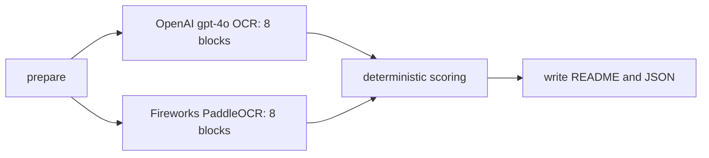

# PaddleOCR-VL 1.6 vs OpenAI gpt-4o OCR

This report was generated by a LangGraph workflow over the same eight bill-of-lading block PNGs. No Tesseract output was used.

## LangGraph topology



## Aggregate results

| Provider | Model/deployment | Matched gold items | Accuracy | Perfect blocks | Successful calls | Total latency | Mean latency |
|---|---|---:|---:|---:|---:|---:|---:|
| OpenAI | `gpt-4o` | 79/79 | 100.0% | 8/8 | 8/8 | 14.908s | 1.863s |
| Fireworks | `accounts/dougchang25-0sh9syiq/deployments/ohotr710` | 79/79 | 100.0% | 8/8 | 8/8 | 2.491s | 0.311s |

## Results by block

| Block | Gold items | OpenAI accuracy | OpenAI missing | OpenAI latency | Paddle accuracy | Paddle missing | Paddle latency |
|---:|---:|---:|---|---:|---:|---|---:|
| 1 | 7 | 100.0% | None | 1.737s | 100.0% | None | 0.355s |
| 2 | 24 | 100.0% | None | 3.613s | 100.0% | None | 0.504s |
| 3 | 6 | 100.0% | None | 1.249s | 100.0% | None | 0.28s |
| 4 | 1 | 100.0% | None | 1.127s | 100.0% | None | 0.128s |
| 5 | 5 | 100.0% | None | 1.227s | 100.0% | None | 0.156s |
| 6 | 23 | 100.0% | None | 2.556s | 100.0% | None | 0.457s |
| 7 | 6 | 100.0% | None | 1.333s | 100.0% | None | 0.151s |
| 8 | 7 | 100.0% | None | 2.066s | 100.0% | None | 0.46s |

## Method

- Input blocks: `/Users/dc/geha/bill_lading/block8_ocr_run_20260927T182357Z/blocks`
- Gold labels: `/Users/dc/geha/bill_lading/bill_of_lading_ground_truth.json`
- Full machine-readable results: `/Users/dc/geha/bill_lading/paddle_vs_gpt4o_run_20260927T192115Z/comparison_results.json`
- Raw OpenAI results: `/Users/dc/geha/bill_lading/paddle_vs_gpt4o_run_20260927T192115Z/openai`
- Raw PaddleOCR results: `/Users/dc/geha/bill_lading/paddle_vs_gpt4o_run_20260927T192115Z/paddle`
- OpenAI receives each complete block with a literal-OCR instruction.
- PaddleOCR receives each identical block using its native `OCR:` or `Table Recognition:` task prompt.
- Paddle table output may contain structural markers such as `<fcel>`, `<ucel>`, and `<nl>`; the raw responses retain those markers.
- Accuracy is deterministic expected-item recall after lowercase and punctuation normalization.
- This recall metric detects omissions but does not fully penalize hallucinated extra text or incorrect reading order. Review raw responses for operational decisions.
- Do not directly compare this whole-block score with the earlier GPT-4o cell-crop run: that workflow supplied additional per-cell images, while this controlled comparison supplies one identical whole-block image to each provider.

## Reproduce

```bash
cd /Users/dc/geha/bill_lading
source ~/.zshrc
/Users/dc/geha/.venv/bin/python langgraph_paddle_vs_chat5.py
```
