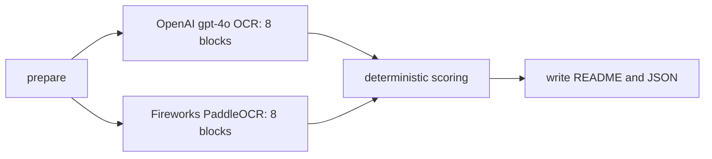

# PaddleOCR-VL 1.6 vs OpenAI gpt-4o OCR

This report was generated by a LangGraph workflow over the same eight bill-of-lading block PNGs. No Tesseract output was used.

## LangGraph topology



## Aggregate results

| Provider | Model/deployment | Matched gold items | Accuracy | Perfect blocks | Successful calls | Total latency | Mean latency |
|---|---|---:|---:|---:|---:|---:|---:|
| OpenAI | `gpt-4o` | 33/79 | 41.77% | 3/8 | 8/8 | 16.121s | 2.015s |
| Fireworks | `accounts/dougchang25-0sh9syiq/deployments/ohotr710` | 78/79 | 98.73% | 7/8 | 8/8 | 5.288s | 0.661s |

## Results by block

| Block | Gold items | OpenAI accuracy | OpenAI missing | OpenAI latency | Paddle accuracy | Paddle missing | Paddle latency |
|---:|---:|---:|---|---:|---:|---|---:|
| 1 | 7 | 71.43% | MERIDIAN SHIPPING; GLOBAL SHIPPING & LOGISTICS | 3.304s | 100.0% | None | 0.929s |
| 2 | 24 | 25.0% | BOOKING REF.; BKG5917532; SHIPPER'S REF.; EXP-35782; PRE-CARRIAGE BY; Oceanic Meridian Lines; CONSIGNEE (NEGOTIABLE ONLY IF CONSIGNED 'TO ORDER'); FRESH FRUIT IMPORTERS B.V.; Handelsweg 12, 2988 DB Ridderkerk, Netherlands; +1 (555) 123-4567; billing@techcorp.com; PLACE OF RECEIPT; NOTIFY PARTY; +31 10 123 4567; dispatch@logitrans.com; DELIVERY AGENT; LogiTrans Global; 88 Harbor Road, Rotterdam, 3011 AA | 2.628s | 100.0% | None | 0.743s |
| 3 | 6 | 33.33% | OCEAN VESSEL / VOYAGE; MERIDIAN LABREA / 124N; PORT OF LOADING; BUENOS AIRES, ARGENTINA | 1.865s | 100.0% | None | 0.402s |
| 4 | 1 | 100.0% | None | 2.043s | 100.0% | None | 0.156s |
| 5 | 5 | 100.0% | None | 1.259s | 100.0% | None | 0.26s |
| 6 | 23 | 34.78% | MRDN4455667; SEAL: MSK112233; MARKS: PALLETIZED; FRESH APPLES; STOWAGE AT +2.0 DEGREES CELSIUS; HS CODE: 08081080; SET TEMP: +2°C; 18,500; KGS; 28.00; CBM; MRDN7788990; SEAL: MSK445566; 19,200; FREIGHT COLLECT | 2.047s | 100.0% | None | 0.941s |
| 7 | 6 | 100.0% | None | 1.507s | 83.33% | 40 | 0.697s |
| 8 | 7 | 0.0% | PLACE OF ISSUE; Antwerp; DATE OF ISSUE; 2026-03-13; SIGNED FOR THE CARRIER; NUMBER OF ORIGINAL B/L'S: THREE (3); Authorized Signature | 1.468s | 100.0% | None | 1.16s |

## Method

- Input blocks: `/Users/dc/geha/bill_lading/block8_ocr_run_20260927T182357Z/blocks`
- Gold labels: `/Users/dc/geha/bill_lading/bill_of_lading_ground_truth.json`
- Full machine-readable results: `/Users/dc/geha/bill_lading/paddle_vs_gpt4o_run_20260927T191215Z/comparison_results.json`
- Raw OpenAI results: `/Users/dc/geha/bill_lading/paddle_vs_gpt4o_run_20260927T191215Z/openai`
- Raw PaddleOCR results: `/Users/dc/geha/bill_lading/paddle_vs_gpt4o_run_20260927T191215Z/paddle`
- OpenAI receives each complete block with a literal-OCR instruction.
- PaddleOCR receives each identical block using its native `OCR:` or `Table Recognition:` task prompt.
- Paddle table output may contain structural markers such as `<fcel>`, `<ucel>`, and `<nl>`; the raw responses retain those markers.
- Accuracy is deterministic expected-item recall after lowercase and punctuation normalization.
- This recall metric detects omissions but does not fully penalize hallucinated extra text or incorrect reading order. Review raw responses for operational decisions.
- Do not directly compare this whole-block score with the earlier GPT-4o cell-crop run: that workflow supplied additional per-cell images, while this controlled comparison supplies one identical whole-block image to each provider.

## Reproduce

```bash
cd /Users/dc/geha/bill_lading
source ~/.zshrc
/Users/dc/geha/.venv/bin/python langgraph_paddle_vs_chat5.py
```
