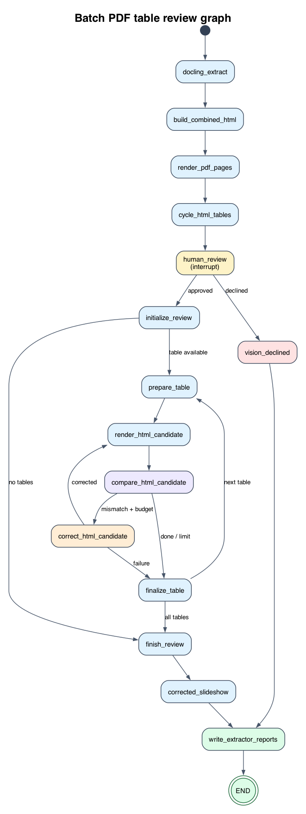
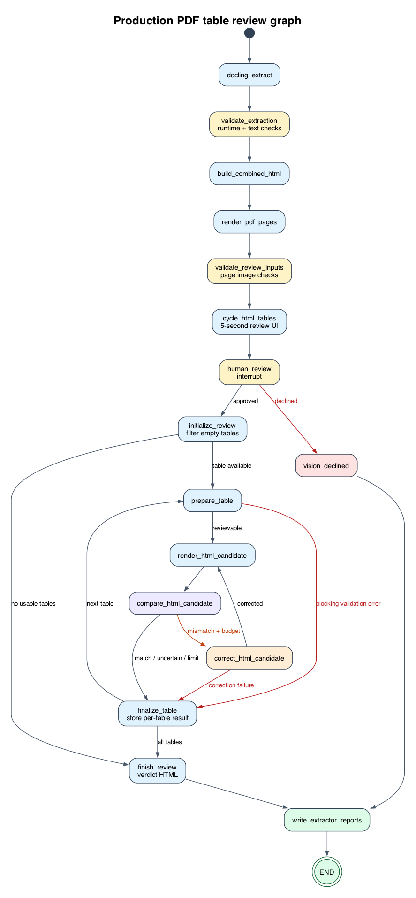

# GEHA clean PDF LangGraph

This project extracts tables from GEHA coverage-policy PDFs with Docling, renders source PDF pages, compares extracted HTML tables against the source images, and writes review artifacts for each PDF.

## Graph diagrams

### Batch review graph

The original graph performs extraction, HTML generation, PDF rendering, human
approval, a bounded compare/correct loop, a corrected-table slideshow, and
report generation.



### Production batch review graph

The production graph adds validation before the human-review and model stages,
keeps failures attached to individual tables, filters empty extraction
artifacts, and writes verdict-aware HTML.



### Differences between the graphs

| Capability | `batch_review_graph.py` | `batch_review_graph_prod.py` |
| --- | --- | --- |
| State typing | `BatchReviewState` `TypedDict` | `ProdBatchReviewState` plus per-table `ReviewFailure` and `ReviewedTable` records |
| Runtime validation | Limited node-level checks | Dedicated `validate_extraction` and `validate_review_inputs` nodes |
| Failure scope | A service-failure value is reset between tables | Failures retain table number, PDF page, stage, type, severity, and safe explanation |
| Empty tables | Can remain in extracted artifacts | Skipped before HTML, slideshow, vision review, and reviewed-table counts |
| Render failure | Can make comparison unverified | Recorded as a warning; comparison continues without the HTML screenshot |
| Correction failure | Becomes uncertain | Preserves the known mismatch and records the failed correction |
| Generated review HTML | Corrected table content | Green verified, red mismatch/error, and amber uncertain/warning cards |
| Final slideshow node | Includes `corrected_slideshow` | Writes verdict HTML directly and then writes the report |

### Error cases detected by the production graph

The production version detects and attributes:

- Missing or incorrectly typed table fields.
- Duplicate or invalid table numbers and out-of-range PDF pages.
- Row-width mismatches and non-string headers or cells.
- Missing extraction artifacts and missing or invalid page PNGs.
- HTML screenshot-rendering failures without stopping later comparison.
- Vision comparison failures and tables above the review-size limit.
- Correction failures and mismatches remaining after the correction budget.
- Raw exception bodies that must be suppressed from reports and HTML.
- Suspicious extracted text before the model is called.

The Datroway page-4 table demonstrated four deterministic text checks:

- `!Updates` was flagged as `SUSPICIOUS_HEADER_PREFIX`; the PDF header is
  `Updates`.
- `�/1/2025` was flagged as `TEXT_REPLACEMENT_CHARACTER`; the funny `�`
  character means text was lost, and the PDF date is `4/1/2025`.
- `P&Twith` was flagged as `MISSING_WHITESPACE_AFTER_ACRONYM`; the PDF says
  `P&T with`.
- `approved bv OH P&T` was flagged as `POSSIBLE_OCR_SUBSTITUTION`; the PDF says
  `approved by OH P&T`.

These warnings are displayed in the raw review slideshow. They do not prevent
the vision comparison from using the PDF as the source of truth. Completely
empty extraction artifacts are skipped rather than reported as content errors.

## Workflow

The batch graph performs these steps:

1. Extract the PDF with Docling.
2. Export the Docling Markdown, chunks, and table Markdown.
3. Add the nearest preceding Markdown heading to each table.
4. Generate combined HTML table artifacts.
5. Render PDF pages to PNG images.
6. Optionally send page images and HTML tables to the vision model.
7. Correct tables when the vision review identifies an extraction error.
8. Write corrected HTML, review reports, and a batch summary.

The PDF remains the source of truth. Corrected HTML is a review artifact and does not modify the original PDF or Docling Markdown.

## Error detection improvements

The graph has backend checks for several failure conditions, but `TypedDict`
does not validate values at runtime. The following changes define how invalid
state, per-table processing failures, and visible review warnings should be
handled.

### 1. Runtime validation

Keep the `TypedDict` definitions for LangGraph state typing, and validate data
at runtime immediately after extraction and before table review begins.

Validate each table for:

- Required keys and expected runtime types.
- A positive, unique table number.
- A page number between `1` and the PDF page count.
- At least one column.
- Rows containing the same number of cells as the column list.
- String column names and cell values.
- An existing rendered page image for the referenced PDF page.
- Existing source Markdown and HTML artifact paths.

Missing global inputs, such as the source PDF or all rendered page images,
should raise a controlled `ReviewStateError`. A malformed individual table
should be marked `uncertain`, receive a validation issue, and be skipped so
later tables can still be reviewed.

### 2. Replace the global failure with per-table results

Do not use one `review_service_failure` value for the entire document. Record
the verdict, issues, failures, correction count, and final markup together for
each table. Each failure should identify its table, PDF page, processing stage
(`validation`, `render`, `compare`, or `correct`), exception type, severity,
and a controlled explanation.

Failure handling should follow these rules:

- A screenshot-rendering failure records a warning but does not prevent the
  HTML-to-PDF comparison.
- A comparison failure marks only that table `uncertain` and allows the next
  table to continue.
- A correction failure preserves the established `mismatch` verdict and its
  original issues, then adds a correction failure.
- A mismatch remaining after the correction limit stays `mismatch` and is sent
  for human review.
- Invalid table structure marks only that table `uncertain` and prevents model
  calls for that table.
- Exception bodies are not persisted because they can contain credentials or
  submitted content. Reports retain only a safe exception type and controlled
  explanation.

`review_service_failure` is reset when each table is prepared so a failure on
one table cannot suppress comparisons for later tables. The failure itself
must also be copied into that table's result before moving to the next table.

### 3. Put verdicts and failures into generated HTML

Generated corrected HTML and the review slideshow should display the result
for every table using text, color, and an issue explanation:

- `match`: green border and a **Verified** badge.
- `mismatch`: red border, a **Mismatch** badge, and the issue list.
- `uncertain`: amber border, a **Human review required** badge, and the reason
  verification could not be completed.
- Rendering or service warning: an amber warning inside the affected table
  card.
- Processing failure: a red alert with no success badge.

The complete table can be outlined with the current data. Highlighting an
individual HTML cell requires validated row and column indices in
`ReviewIssue`. Drawing a bounding box on the PDF image additionally requires
normalized PDF coordinates; textual evidence alone is not sufficient.

## Regression tests

The original graph includes this regression test:

- `test_prepare_table_clears_previous_service_failure` verifies that preparing
  a new table clears a prior service failure, resets the verdict to
  `uncertain`, and resets the correction-attempt counter.

The separate production implementation is in
`src/batch_review_graph_prod.py`. Its labeled test inputs are stored in
`src/test_data/batch_review_graph_prod_cases.json`; each case ID identifies the
corresponding test method and expected error code or visual class. The
production regression tests in `src/test_batch_review_graph_prod.py` verify:

- A comparison failure on table 1 does not prevent table 2 from being
  compared.
- Table 1 retains its recorded failure after table 2 is prepared.
- A screenshot-rendering failure still allows the comparison call.
- A correction failure preserves the original mismatch verdict and issues.
- A mismatch remaining at the correction limit receives a red mismatch card.
- An uncertain result receives an amber card and a human-readable reason.
- Invalid page numbers and rows with incorrect cell counts are rejected before
  rendering or model calls.
- Replacement characters, suspicious header punctuation, missing whitespace
  after acronyms, and likely `bv`/`by` OCR substitutions are flagged before
  vision review and displayed in the raw table slideshow.
- Empty extraction artifacts with no nonblank headers or cells are omitted from
  HTML generation, the slideshow, vision calls, and reviewed-table counts.
- Reports and generated HTML never contain raw exception bodies or credentials.

Run the production regression suite with:

```bash
cd /Users/dc/geha/clean_pdf_langgraph
PYTHONDONTWRITEBYTECODE=1 python -m unittest src.test_batch_review_graph_prod
```

Run the production graph with the same arguments as the original graph:

```bash
/Users/dc/geha/.venv/bin/python -m src.batch_review_graph_prod \
  --input-dir /Users/dc/geha/downloads/coverage-policies
```

### Permanent error-detection demo UI

`error_detection_demo.html` is a permanent, searchable visual catalog of all
labeled simulated cases. It shows the case ID, condition, expected error code
or verdict, regression-test mapping, and the corresponding red, amber, or green
visual cue.

Regenerate it after changing the case fixture:

```bash
cd /Users/dc/geha/clean_pdf_langgraph
/Users/dc/geha/.venv/bin/python -m src.error_detection_demo
```

Then open `error_detection_demo.html` in a browser.

## Install

From the repository environment:

```bash
cd /Users/dc/geha
uv sync
```

The SQLite checkpoint dependency is required when running the batch workflow. Graph visualization itself does not require opening a checkpoint.

## Run the 32-policy batch

Start a fresh run:

```bash
cd /Users/dc/geha/clean_pdf_langgraph

/Users/dc/geha/.venv/bin/python -m src.batch_review_graph \
  --input-dir /Users/dc/geha/downloads/coverage-policies
```

To prevent the slideshow from opening while still producing screenshots and corrected HTML:

```bash
GEHA_NO_BROWSER=1 \
/Users/dc/geha/.venv/bin/python -m src.batch_review_graph \
  --input-dir /Users/dc/geha/downloads/coverage-policies
```

Each run is written to a new directory under `review_runs/`.

## Review corrected HTML

After a successful run, cycle through only corrected HTML files:

```bash
/Users/dc/geha/.venv/bin/python artifact_slideshow.py \
  --directory /Users/dc/geha/clean_pdf_langgraph/review_runs/<run-directory> \
  --recursive \
  --corrected-only \
  --interval 1 \
  --port 8765
```

Open `http://127.0.0.1:8765` in a browser.

## Graph visualization notebook

Open `src/batch_review_graph_visualization.ipynb` to import the current graph, print its Mermaid representation, and regenerate the PNG visualization.

```bash
cd /Users/dc/geha/clean_pdf_langgraph
/Users/dc/geha/.venv/bin/jupyter notebook src/batch_review_graph_visualization.ipynb
```

## Output files

Each PDF output directory can contain:

- `<policy>.docling.md` — Docling Markdown export
- `<policy>.docling_chunks.md` — chunked text with provenance
- `<policy>_docling_tables.md` — extracted tables with nearest headings
- `<policy>_docling_tables.html` — first-pass HTML tables
- `<policy>_docling_tables_corrected.html` — corrected HTML tables
- `<policy>_images_<page>.png` — rendered PDF pages
- `<policy>_docling_errors.md` — visual review report
- `checkpoint.sqlite` — LangGraph checkpoint state

The batch-level `batch_summary.json` records the status and output directory for every PDF.
