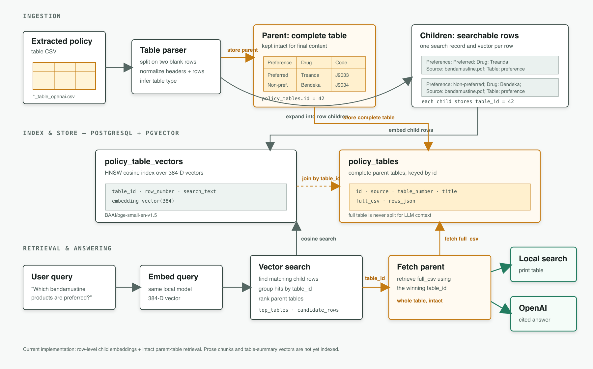

# GEHA

## RAG Architecture
The table-aware RAG system embeds individual table rows for retrieval while preserving each complete table as the parent context returned to local search or the configured language model.

See [Table-Aware Coverage Policy RAG](chunking_benchmarks/README.md) for setup, ingestion, search, evaluation, and testing instructions.

# HTML Version
![table_aware_parsing.apng]

