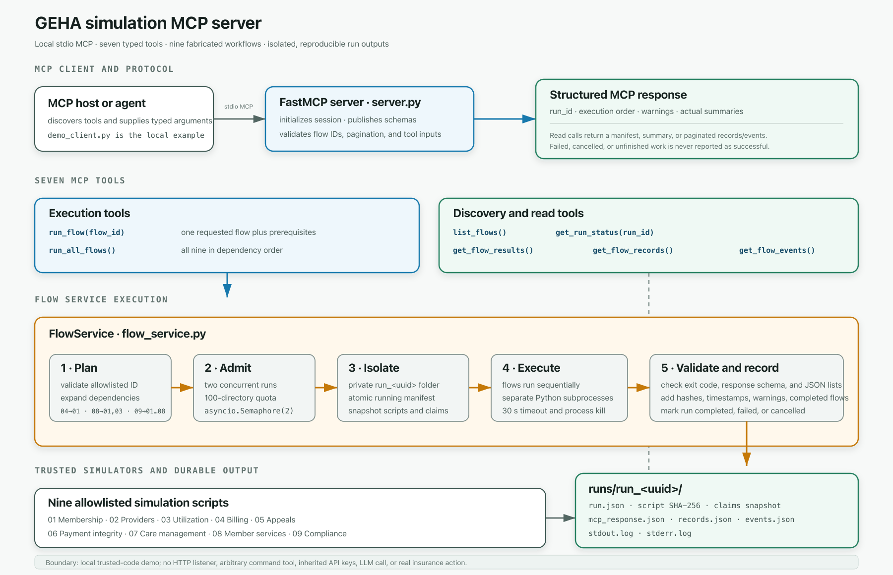

# GEHA

## High-level simulations

These simulations were drafted with assistance from an LLM. The LLM accelerated
the initial modeling of common health-insurance processes, but its output must be
validated against authoritative requirements and reviewed by subject-matter
experts. The simulations use synthetic data and do not represent production
insurance operations or regulatory compliance.

The `highlevel_simulation` directory contains nine deterministic health-payer
process simulations. The flow service defines their dependencies and runs them
in the required order. For example, premium billing depends on membership data,
while compliance depends on evidence generated by the preceding flows.

This high-level coordination is implemented with ordinary Python rather than
LangGraph. LangGraph is more useful for stateful, request-specific workflows
that require conditional routing, durable checkpoints, retries, human review,
or resumption after interruption.

For example, a membership-enrollment application could use LangGraph to persist
the applicant's state under a thread ID. If the applicant leaves before
completion, the workflow could later resume from its saved checkpoint rather
than restart from the beginning.

The same behavior could be implemented without LangGraph using application code
and a database. LangGraph's advantage is its workflow-state model and integration
with tracing and evaluation tools. LangGraph can persist workflow state, while
tools such as LangSmith or Langfuse can record and analyze execution traces.

Trajectory data may later support debugging, evaluation, and workflow
improvement, but it currently has no effect on these deterministic simulations.

Folder: `highlevel_simulation`


## Download and the ground truth
Download the documents from the website. These serve as a reference to the ground truth. 
There are other souces of ground truth, a database schema, a workflow, a document indicating what the process is to sign up for a new policy. 

Folder: `downloads`


## RAG Architecture
The table-aware RAG system embeds individual table rows for retrieval while preserving each complete table as the parent context returned to local search or the configured language model.


See [Table-Aware Coverage Policy RAG](chunking_benchmarks_RAG/README.md) for setup, ingestion, search, evaluation, and testing instructions.



Folder: `chunking_benchmarks_RAG`

## Runnable demos

This repository contains focused LangGraph, table-RAG, MCP, and web demos that
share a small set of fabricated fixtures in `demo_data/`. Run the Python
applications through `uv` or Streamlit and the TypeScript application through
npm.

### LangGraph Streamlit application

This is the quickest interactive demonstration of the synthetic claim-review
workflow:

```bash
cd /Users/dc/geha/langgraph_demo
uv sync
uv run streamlit run app.py --server.address 127.0.0.1 --server.port 8503
```

Open `http://localhost:8503`. See
[langgraph_demo/README.md](langgraph_demo/README.md) for the workflow and review
instructions.

### LangGraph command-line demonstration

```bash
cd /Users/dc/geha/langgraph_demo
uv run demo.py example
uv run demo.py start
```

The `start` command prints a thread ID. Use the commands documented in
[langgraph_demo/README.md](langgraph_demo/README.md) to inspect or review that
thread.

### Standalone RAG application

```bash
cd /Users/dc/geha/RAG_demo
uv sync
uv run streamlit run app.py
```

See [RAG_demo/README.md](RAG_demo/README.md) for ingestion, local model, and
evaluation options.

### MCP end-to-end demonstration

```bash
cd /Users/dc/geha/MCP_server
uv sync
uv run --locked demo_client.py
uv run --locked demo_client.py --run-all
```

The first client command discovers the MCP tools without running simulations.
The second creates an isolated run and executes all flows. To start only the
stdio MCP server for an MCP host:

```bash
uv run --locked server.py
```

See [MCP_server/README.md](MCP_server/README.md) for the tools, safeguards, and
generated run artifacts.

### Table-aware RAG command line

Run these commands from the repository root:

```bash
cd /Users/dc/geha
uv sync
docker compose -f chunking_benchmarks_RAG/docker-compose.pgvector.yml up -d
uv run python chunking_benchmarks_RAG/table_rag.py init-db
```

The same program provides the `ingest`, `search`, and optional `ask` commands.
Their required arguments and database configuration are documented in
[chunking_benchmarks_RAG/README.md](chunking_benchmarks_RAG/README.md).

### Shared synthetic fixtures

`demo_data/` contains the fabricated claim records, recorded claim outcomes,
and curated public-reference snippets used by LangGraph and MCP. These files
are read-only demo inputs, not real claims, live coverage rules, or production
systems of record.

### LangGraph TypeScript web application

```bash
cd /Users/dc/geha/langgraph_web
npm ci
npm run dev
```

For a production build:

```bash
npm run build
npm start
```

See [langgraph_web/README.md](langgraph_web/README.md) for configuration details.
