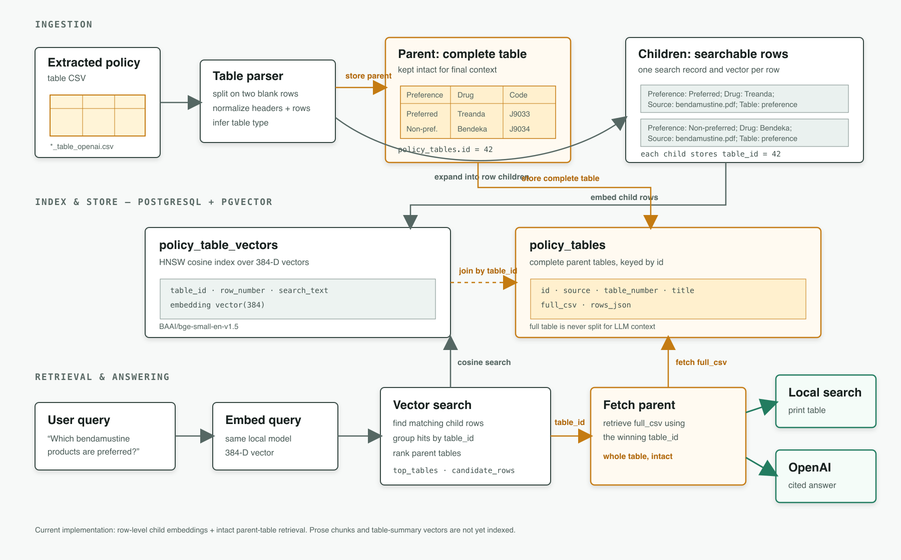
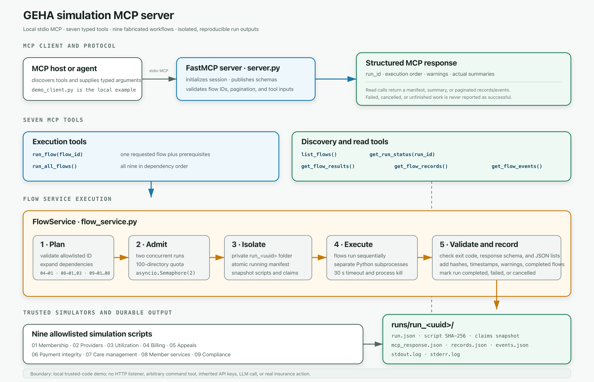

# GEHA

aws_rag
https://pdh62b4ddxm6mw7aokdbtwream0nupph.lambda-url.us-west-2.on.aws/chat

## GCP Vertex AI RAG

[`gcp_vertex_rag`](gcp_vertex_rag/README.md) is the Google Cloud counterpart to
`aws_rag`. It uploads the coverage-policy PDFs in `downloads` to a private,
versioned Cloud Storage bucket, imports them into Vertex AI RAG Engine, and
serves grounded Gemini answers with citations through an authenticated Cloud
Run service. The sample includes Terraform, Cloud Build, a browser UI, and
offline tests.


agentic_search:
Code References: The chat UI and PDF viewer comes from Lightning AI which is a chat assistant: 
https://lightning.ai/lightning-ai/templates/document-chat-assistant-using-rag?section=featured

e2e_bm25vector:
Deployable Vercel comparison app for BM25, vector, and hybrid retrieval with
optional reranking and grounded answer generation.


Code References: 

## Download and the ground truth
Download the documents from the website. These serve as a reference to the ground truth. These are policy documents, membership details for the public API. 
2/31 documents dont have text im the pdf. LLM OCR on pdf image only files. 6% improment in performance (2/31).

Folder: `downloads`

## chunking_benchmarks_RAG
Docling preserves the context and seems to be the default chunking setting for most docs

200page pdf sent to LLM for OCR produces errors. Segment 200 pages to 200 individual pages, convert to markdown and html. Use single page pdf as image source. Langgraph program in loop; compare html w pdf and have agent correct html w to pdf with no visible errors or zero text errors. 

Zero errors but slow for large batches. Might be ok for small num errors per page. 

Tables don't parse well. The naive approach is to copy each row with column headings and a couple title blocks or captions and insert as an embedding. This doesn't work because the semantic meaning of the table unit is lost. Demo of Treanada approved with unapproved tables. A query returns the table. The point is to shw the mismatch between specific keywords and vector search. BM25 better here or even better yet include structured search from DB tables. 

## PDF Processing flow
Problem: how to recognize forms. Different than tables. 
Blockiung demo 


Folder: `PDF_processing/clean_pdf_langgraph`

## Bounding Box Medical Form Processing Flow
There are no medical claim forms which are public because of privacy violations. Create processing flow for bill of lading. Extract to md and html, correct html w single page PDF until no errors. Max loops 2-6.  

Folder `/Users/dc/geha/PDF_processing/blocking_demo`

## RAG Architecture
The table-aware RAG system embeds individual table rows for retrieval while preserving each complete table as the parent context returned to local search or the configured language model.



See [Table-Aware Coverage Policy RAG](chunking_benchmarks_RAG/README.md) for setup, ingestion, search, evaluation, and testing instructions.



Folder: `chunking_benchmarks_RAG`

## Runnable demos

This repository contains focused LangGraph, table-RAG, MCP, and web demos that
share a small set of fabricated fixtures in `demo_data/`. Run the Python
applications through `uv` or Streamlit and the TypeScript application through
npm.


See [MCP_server/README.md](MCP_server/README.md) for the tools, safeguards, and
generated run artifacts.

### Table-aware RAG command line

Run these commands from the repository root:

```bash
cd /Users/dc/geha
uv sync
docker compose -f chunking_benchmarks_RAG/docker-compose.pgvector.yml up -d
uv run python chunking_benchmarks_RAG/table_rag.py init-db
```

The same program provides the `ingest`, `search`, and optional `ask` commands.
Their required arguments and database configuration are documented in
[chunking_benchmarks_RAG/README.md](chunking_benchmarks_RAG/README.md).

### Shared synthetic fixtures

`langgraph_python_review_claims/demo_data/` contains the fabricated claim records, recorded claim outcomes,
and curated public-reference snippets used by LangGraph and MCP. These files
are read-only demo inputs, not real claims, live coverage rules, or production
systems of record.

### LangGraph TypeScript web application

```bash
cd /Users/dc/geha/langgraph_web
npm ci
npm run dev
```

For a production build:

```bash
npm run build
npm start
```

See [langgraph_web/README.md](langgraph_web/README.md) for configuration details.

## Continuous integration

[GEHA CI](.github/workflows/ci.yml) runs on pull requests and pushes to `main`.
It checks focused policy-RAG and PDF-extraction unit tests, the LangGraph
workflow smoke tests, and MCP server contracts in their locked Python
environments. These checks use local fixtures and do not require an API key,
live PostgreSQL, or model downloads. Database-backed retrieval evaluations,
vision review, and deployment tests remain separate manual checks; CI does not
certify clinical correctness or HIPAA compliance.
