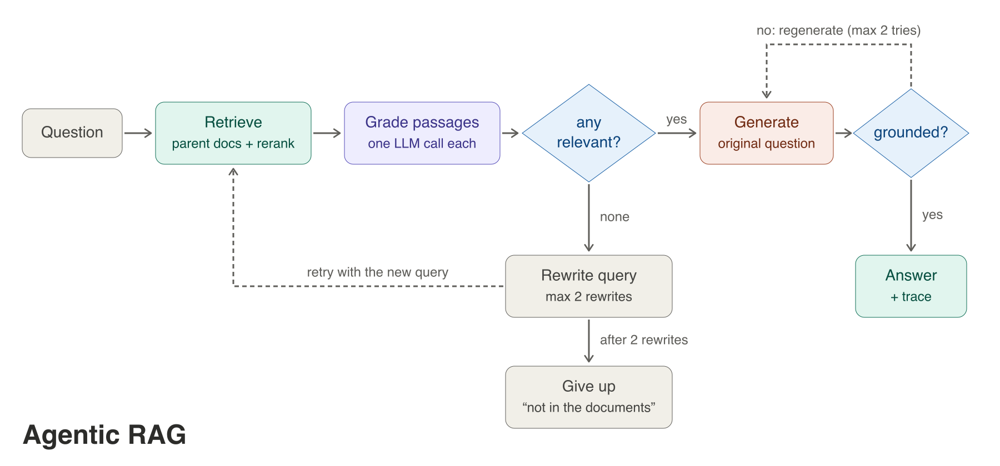

# Agentic search

This project includes PDF loading, chunking, Chroma retrieval, bounded agentic
query rewriting, optional reranking, grounded answer generation, and a
retrieval-only evaluation command.

## Install

```bash
cd /Users/dc/geha/agentic_search
uv pip install -r requirements.txt
```

Set `OPENAI_API_KEY` in the environment before using OpenAI generation or
evaluation models.

## Test

```bash
cd /Users/dc/geha/agentic_search/src
python -m unittest test_agentic_rag test_react_rag test_class_refactor test_retrieval_benchmark
```

## Agentic RAG



`src/agentic_rag.py` wraps `RagClient` in a LangGraph loop inspired by
[Corrective Retrieval Augmented Generation (CRAG)](https://arxiv.org/abs/2401.15884)
([local PDF](data/2401.15884v3.pdf)) and
[Self-RAG: Learning to Retrieve, Generate, and Critique through Self-Reflection](https://arxiv.org/abs/2310.11511)
([local PDF](data/2310.11511v1.pdf)). It reuses the client's parent-document
retriever, reranker and answer chain; no existing file changes.

1. **Retrieve** with the parent-document retriever, then the reranker (`none` or `gpt`).
2. **Grade** each passage with a structured-output call (`relevant: bool`) and keep the relevant ones.
3. **Rewrite** the search query if none is relevant and retrieve again, at most twice;
   after that, **give up** with "I could not find this in the documents." rather than
   answer from weak passages.
4. **Generate** with the existing answer chain, always from the original question.
5. **Check** that every claim is supported by the passages; if not, regenerate (at most two
   generations in total).

`AgenticRag.generate()` returns the same keys as `RagClient.generate()` (`response`,
`contexts`, `retrieved_contexts`) plus `grounded` and a `trace` of the steps taken.

```bash
cd /Users/dc/geha/agentic_search/src
python agentic_rag.py "What reflection tokens does Self-RAG use?" --pdf ../data/2310.11511v1.pdf
python -m unittest test_agentic_rag      # fakes only: no API key, model download or PDF
```

The unit tests cover: answering once when the first retrieval is relevant, rewriting
when nothing is relevant, giving up after two rewrites, regenerating an ungrounded
answer, bounding regeneration, and answering the original question rather than the
rewritten query.

Cost: grading makes one LLM call per retrieved passage, plus the answer and the check, so a
question costs several times the plain pipeline. Pass a cheaper model for those calls with
`AgenticRag(client, llm=ChatOpenAI(model_name="gpt-4o-mini"))`.


## ReAct agent

`src/agentic_rag.py` is a fixed workflow: the graph decides every step and the LLM only answers
yes/no grading questions. `src/react_rag.py` is the agentic alternative: the retriever and
reranker are wrapped as a `search_documents` tool, and a tool-calling model decides whether to
search, what to search for, how many times, and when to answer.

1. **Agent**: the model either calls `search_documents` (possibly several queries at once) or answers.
2. **Search**: each query runs the parent-document retriever and the reranker; the top passages are
   returned numbered (`[1]`, `[2]`, ...). A passage keeps its number when a later search finds it again,
   so citations stay unique across searches.
3. Back to the agent, until it answers or the search budget (`max_searches`, default 4) is spent.
   After that the model is called with `tool_choice="none"` and must answer from what it has.

`ReactRag.generate()` returns the same keys as `RagClient.generate()` (`response`, `contexts`,
`retrieved_contexts`) plus `searches` and a `trace`. It does not grade passages or check
groundedness; the model decides relevance itself, which suits multi-part questions better and
costs fewer calls on easy ones.

```bash
cd /Users/dc/geha/agentic_search/src
python react_rag.py "How does Self-RAG decide when to retrieve?" --pdf ../data/2310.11511v1.pdf
python -m unittest test_react_rag       # fakes only: no API key, model download or PDF
```


## Retrieval benchmark

The retrieval-only benchmark exercises the actual dense parent-document path:
PDF extraction, token-aware parent/child chunking, BGE embeddings, Chroma
maximum-inner-product retrieval, and parent lookup. It does **not** call an
answer-generation or evaluator model, so its metrics isolate retrieval behavior.

The versioned fixture contains 14 grounded questions over seven tracked PDFs.
Gold labels are source filenames. Because several parent chunks can come from
one PDF, retrieved chunks are deduplicated by source before calculating:

| Metric | Meaning |
|---|---|
| Recall@5 | Fraction of relevant source PDFs found in the first five unique sources |
| MRR@10 | Reciprocal rank of the first relevant source, capped at rank 10 |
| nDCG@10 | Position-discounted ranking quality for all relevant sources through rank 10 |
| Latency | Median and p95 retriever query time; model loading and indexing are excluded |

Run the production BGE profile used in CI:

```bash
i see 
```

For a faster development-only comparison, replace the model argument with
`BAAI/bge-small-en-v1.5`. Do not compare its latency directly with the large
model's CI baseline.

Observed local baseline on the 14-question fixture (2026-09-30):

| Embedding profile | Recall@5 | MRR@10 | nDCG@10 | Median latency |
|---|---:|---:|---:|---:|
| `BAAI/bge-large-en-v1.5` | 1.0000 | 1.0000 | 1.0000 | 86.9 ms |
| `BAAI/bge-small-en-v1.5` | 1.0000 | 0.9643 | 0.9736 | 14.8 ms |

CI gates are intentionally below that baseline: Recall@5 ≥ 0.90, MRR@10 ≥
0.80, nDCG@10 ≥ 0.82, and median latency ≤ 2,000 ms. The broad latency budget
allows for shared GitHub CPU runners while still catching severe regressions.
The workflow publishes both JSON evidence and a Markdown summary as artifacts.
