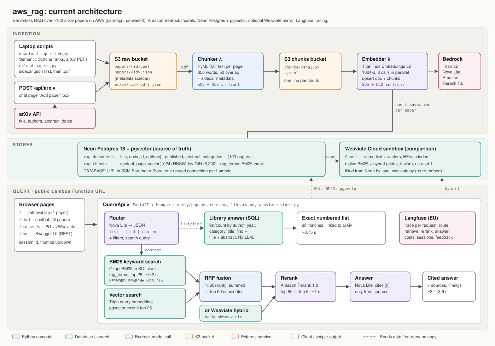

# aws version of RAG



*Current architecture. Source: `docs/architecture.svg` (a PNG copy is in `docs/architecture.png`).*

A serverless RAG demo on AWS. When a PDF is uploaded to S3, it is split into
page-aware text chunks (one JSONL file per document), and those chunks are
embedded and loaded into Postgres/pgvector (Neon). A PDF dropped in S3 shows up
in the UI's document picker within seconds.

The query side, the UI plus the search API with BM25, vector, hybrid, the LLM
reranker and grounded answers, is a FastAPI app in a Lambda behind a public
Function URL.

This project started as a port of `../e2e_RAG/vercel_app`, and that Vercel
deployment has been retired. The code here is now the source of truth.

```
S3 raw bucket (*.pdf)
 │  s3:ObjectCreated
 ▼
SQS ChunkQueue ──(3 failures)──► SQS dead-letter queue
 │  batches of up to 5
 ▼
Lambda Chunker (Python 3.12 + PyMuPDF)
 │  text per page → 350-word chunks, 50-word overlap
 ▼
S3 chunks bucket: chunks/<sha256 of PDF>.jsonl
 │  s3:ObjectCreated (prefix chunks/, suffix .jsonl)
 ▼
SQS EmbedQueue ──(3 failures)──► SQS dead-letter queue
 │  one file at a time, at most 2 Lambdas at once
 ▼
Lambda Embedder (Amazon Titan Text Embeddings v2 on Bedrock, 1024-d, 8 calls in parallel)
 │  one transaction: upsert rag_documents, replace rag_chunks
 ▼
Postgres + pgvector on Neon (DATABASE_URL)
 ▲
 │  BM25 / vector / hybrid retrieval, rerank, answer
Lambda QueryApi (FastAPI via Mangum) ◄── Function URL ◄── browser
 │  GET /  serves the UI; /api/documents, /api/search
 ▼
Amazon Bedrock (Titan v2 query embedding, Amazon Rerank 1.0, Nova Lite answer)
```

Each JSONL line looks like:

```json
{"document_id": "<sha256>", "source": "s3://<bucket>/<key>", "chunk_index": 0, "page_number": 1, "content": "..."}
```

## Layout

| Path | Purpose |
|---|---|
| `template.yaml` | AWS SAM stack: both buckets, both queues + DLQs, queue policies, S3 notifications, both Lambdas |
| `chunker/handler.py` | Lambda handler (SQS → S3 PDF → JSONL) |
| `schema.sql` | `rag_documents` / `rag_chunks` tables and the HNSW vector index |
| `chunker/rag_core.py` | `chunk_text()` and retrieval helpers (same file as `query/rag_core.py`) |
| `chunker/requirements.txt` | Lambda dependencies (`pymupdf`; `boto3` is provided by the runtime) |
| `embedder/handler.py` | Lambda handler (SQS → S3 JSONL → Bedrock embeddings → Postgres) |
| `embedder/requirements.txt` | `psycopg[binary]`, `pgvector` (`boto3` comes with the runtime) |
| `query/lambda_function.py` | Lambda entry point: loads `DATABASE_URL` from Parameter Store, serves `index.html` at `/`, wraps the app with Mangum |
| `query/app.py` | FastAPI search API: `/api/documents`, `/api/search` (BM25, vector, hybrid, rerank, answer) |
| `query/rag_core.py` | BM25 and reciprocal-rank fusion |
| `query/index.html` | The retrieval lab UI (`/`) |
| `query/chat.py`, `query/chat.html` | Paper chatbot: `/api/chat`, `/api/arxiv`, and the `/chat` page |
| `query/requirements.txt` | `fastapi`, `mangum`, `psycopg[binary]`, `pgvector`, `langfuse` |

## Prerequisites

- **Amazon Bedrock access in the stack's region.** Amazon models (Nova, Titan)
  work out of the box, and every model in this stack is an Amazon model. (Third-
  party models such as Cohere are billed through AWS Marketplace and fail with
  `INVALID_PAYMENT_INSTRUMENT` unless the account has a payment method
  Marketplace accepts.) No model API keys are involved: the Lambdas
  authenticate to Bedrock with their IAM roles.

- An AWS account and credentials that can create S3, SQS, Lambda, IAM roles and
  CloudFormation stacks.
- AWS CLI v2: `aws sts get-caller-identity` should print your account.
- AWS SAM CLI: `brew install aws-sam-cli`.
- Docker (recommended): lets `sam build` install PyMuPDF's Linux wheel.

If your AWS profile uses `aws login` and SAM says it needs `botocore[crt]`,
export temporary credentials into the shell first:

```bash
eval "$(aws configure export-credentials --format env)"
```

## One-time setup: database and connection string

The pipeline uses a Postgres database with pgvector: a Neon database
(originally created through Vercel's Neon integration). Create the tables once;
this is safe to re-run:

```bash
psql "$DATABASE_URL" -f schema.sql
```

The Lambda has no VPC, so the database must accept connections from the
internet (Neon, Supabase and similar do, over TLS). Include `sslmode=require` in
the URL if your provider needs it.

Store the connection string as an SSM Parameter Store SecureString in the
stack's region. Standard parameters are free (Secrets Manager costs
$0.40/month). Parameter names can't start with `aws`. With `DATABASE_URL`
exported in your shell:

```bash
printf %s "$DATABASE_URL" | aws ssm put-parameter --region us-west-2 \
  --name /rag-demo/database-url --type SecureString --value file:///dev/stdin
```

To change it later, run the same command with `--overwrite`. Running Lambdas
pick up the new value on their next cold start. A different parameter name can
be passed with `sam deploy --parameter-overrides DatabaseUrlParameter=/...`.

## Deploy

```bash
cd /Users/dc/geha/aws_rag
sam build --use-container
sam deploy --guided
```

In the `--guided` prompts, pick a stack name (e.g. `pdf-chunker`) and a region,
answer **Y** to "Allow SAM CLI IAM role creation", and save the answers to
`samconfig.toml`. After that, redeploys are just `sam build --use-container && sam deploy`.

Always run `sam build` before `sam deploy`. Without it, SAM uploads the raw
`chunker/` folder with no PyMuPDF, and every invocation fails with
`Runtime.ImportModuleError: No module named 'pymupdf'`. Plain `sam build`
(without Docker) also works: it fetches PyMuPDF's manylinux wheel.

The bucket names come from the stack name and account ID, so they are:

- `<stack>-raw-<account-id>`: upload PDFs here
- `<stack>-chunks-<account-id>`: chunk files appear here

To print them and the queue URLs:

```bash
aws cloudformation describe-stacks --stack-name pdf-chunker \
  --query "Stacks[0].Outputs" --output table
```

## Run it

Set variables from the stack outputs:

```bash
STACK=pdf-chunker
ACCOUNT=$(aws sts get-caller-identity --query Account --output text)
RAW=$STACK-raw-$ACCOUNT
CHUNKS=$STACK-chunks-$ACCOUNT
```

Upload a PDF (any key ending in `.pdf` triggers the chunker):

```bash
aws s3 cp ../e2e_RAG/data/1706.03762v7.pdf s3://$RAW/papers/
```

Within a few seconds a chunk file appears:

```bash
aws s3 ls s3://$CHUNKS/chunks/
aws s3 cp s3://$CHUNKS/chunks/<sha256>.jsonl - | head -3
```

Follow the Lambda logs (each document logs `source -> output (N chunks)`):

```bash
sam logs --stack-name $STACK --name Chunker --tail
sam logs --stack-name $STACK --name Embedder --tail
```

A few seconds after the chunk file lands, the embedder logs
`-> rag_chunks (N chunks, document …)`. The document then appears in the
UI's document picker, titled with the PDF's file name, or you can check with:

```bash
psql "$DATABASE_URL" -c "SELECT d.title, count(c.id) FROM rag_documents d JOIN rag_chunks c ON c.document_id = d.id GROUP BY d.title"
```

### Query UI and API

Open the `QueryUrl` output in a browser:

```bash
aws cloudformation describe-stacks --stack-name $STACK \
  --query "Stacks[0].Outputs[?OutputKey=='QueryUrl'].OutputValue" --output text
```

Pick a document, a retrieval mode, and optionally the reranker and answer
generation. Selecting a document fills in a starter question for the three
demo papers; the question box is editable. The API can also be called
directly:

```bash
URL=$(aws cloudformation describe-stacks --stack-name $STACK \
  --query "Stacks[0].Outputs[?OutputKey=='QueryUrl'].OutputValue" --output text)
curl -s ${URL}api/documents
curl -s -X POST ${URL}api/search -H 'Content-Type: application/json' -d '{
  "document_id": "<id from /api/documents>", "query": "what is orca",
  "retrieval_mode": "hybrid", "use_reranker": true, "generate_answer": true, "top_k": 3}'
```

A hybrid + rerank + answer query takes about 3–3.5 s: roughly 0.3 s BM25,
0.3 s vector, 0.5 s rerank and 0.8–1.3 s generation. The first request after
idle adds a second or two of cold start.

The Function URL is public (`AuthType: NONE`), and
each search with rerank or answer generation costs Bedrock usage. Switch to
`AuthType: AWS_IAM` or put it behind CloudFront + WAF if it shouldn't be open.

### Paper chatbot

`/chat` on the same URL (the `ChatUrl` output) is a multi-turn chatbot over all
indexed papers, with cited answers and an "add an arXiv paper" box. It's served
by `query/chat.py` (`POST /api/chat`, `POST /api/arxiv`) and `query/chat.html`.
Papers added by arXiv ID land in `s3://<raw>/arxiv/`, with their title passed
through S3 metadata → chunker → embedder. See [`../chatbot`](../chatbot) for
the design, the `add_arxiv.py` command-line loader, cost and limits.

### Tracing with Langfuse

Every chat message and lab search is traced to [Langfuse](https://langfuse.com)
(Langfuse Cloud, EU region by default). A chat trace (`chat-turn`) contains
`rewrite` (follow-ups only), `retrieve` → `embed-query`, `rerank` and `answer`,
with the prompts, retrieved chunk IDs, rerank scores, token usage and timings.
Each chat page load is one Langfuse **session**, and 👍/👎 under an answer is
stored as a `user-feedback` score on its trace (`POST /api/feedback`).

Setup: create a Langfuse project, then store its keys in Parameter Store:

```bash
printf %s "$LANGFUSE_PUBLIC_KEY" | aws ssm put-parameter --region us-west-2 \
  --name /rag-demo/langfuse-public-key --type SecureString --value file:///dev/stdin
printf %s "$LANGFUSE_SECRET_KEY" | aws ssm put-parameter --region us-west-2 \
  --name /rag-demo/langfuse-secret-key --type SecureString --value file:///dev/stdin
```

For a US-region project deploy with
`--parameter-overrides LangfuseBaseUrl=https://us.cloud.langfuse.com`. Without
the parameters, tracing is disabled and everything else works. Traces are
flushed at the end of each request, because Lambda freezes between requests.

Costs: Langfuse has no Bedrock prices built in. The code reports embedding
and rerank costs itself (`EMBEDDING_PRICE_PER_TOKEN`, default $0.02/1M Titan
tokens; `RERANK_PRICE_PER_UNIT`, default $0.001 per search unit of up to 100
chunks). Nova Lite is priced by a model definition in the Langfuse project
(**Settings → Models**: `amazon.nova-lite-v1:0`, $0.06 input / $0.24 output
per 1M tokens), so add one there if you change `GenerationModel`. A follow-up
chat message comes to about $0.0012, mostly rerank. Prices apply to traces
received after they're set.

Traces contain questions, retrieved passages and answers. That's fine for
public arXiv papers; think twice before tracing sensitive documents.

### Paper metadata (arXiv)

`rag_documents` stores each paper's arXiv metadata: `arxiv_id`, `authors`,
`published`, `updated`, `abstract`, `primary_category`, `categories`,
`comment`, `journal_ref` and `doi` (see `schema.sql`). The metadata travels
with the PDF as a sidecar JSON next to it in S3 (`papers/2306.02707.pdf` +
`papers/2306.02707.json`). The chunker adds it to the first line of the chunk
file, and the embedder writes it to the row; a re-run without metadata keeps
what's stored. `POST /api/arxiv` writes the sidecar automatically (via
`query/arxiv_meta.py`). For papers indexed earlier, run once:

```bash
python scripts/backfill_arxiv_metadata.py --dry-run   # then without --dry-run
```

Questions about the library itself ("which papers do you have?", "who wrote
X?") are answered from these columns with SQL; see "Chat routing" below.
`GET /api/documents` takes the same filters: `author` (whole words, e.g.
`?author=Kaiming%20He`), `year_from`, `year_to`, `category` (arXiv code, e.g.
`cs.CV`) and `q` (words in the title or abstract, ranked by relevance).

### Chat routing

Every chat message first goes through a **router**. Questions about the
library are answered exactly from `rag_documents` with SQL; everything else
goes through RAG as before.

```
POST /api/chat → QueryApi Lambda (chat.py)
  _route(messages)        one Nova Lite call → {"route": "list" | "find" | "content",
                          filters (author, years, category, title, topic), search_query}
  ├─ list   → library.find_papers(filters)            "show all titles", "how many papers",
  │                                                    "papers by Kaiming He", "who wrote Adam?"
  ├─ find   → library.find_papers(topic=…) over        "which papers are about object detection?",
  │           title + abstract (Postgres full-text)    "anything on GANs?"
  └─ content → search → rerank → Nova Lite answer      "what is dropout?", "how was Orca evaluated?"
```

- **List and find answers are built by code, not written by the model.** They're
  complete (all 103 titles, not the ~10 a model will reproduce), carry no invented
  citations, and take about 1.5–2.5 s. The chat page renders them as a numbered
  list linking to arXiv.
- **The router replaces the old rewrite step:** its `search_query` is the
  standalone version of a follow-up, so a content turn still makes one extra
  model call. The router also runs on the first turn, adding ~0.4 s there.
- **The paper catalog is no longer in the answer prompt,** saving ~6,000 input
  tokens on every content question at 100 papers.
- **Topic search** matches the router's `topic` against titles and arXiv
  abstracts. The router adds synonyms ("GAN or generative adversarial"); all
  words are required first, then any word if nothing matches.
- **If the router's JSON can't be parsed,** the message falls back to `content`,
  so the worst case is today's RAG behaviour. Each decision is recorded on the
  Langfuse trace (`route` generation, `route` metadata on `chat-turn`).
- **Mixed questions** ("summarise the papers by Kaiming He") go to `content`;
  answering them needs a list-then-retrieve step that isn't built.

**What implements the router:** a function (`_route`, plus `_answer_library`
and `library.py`) inside the existing QueryApi Lambda, not a separate Lambda.
It needs the same database connection, Bedrock client and request context, and
a Lambda-to-Lambda hop would add network latency and a possible second cold
start to a ~0.4 s decision. It would be worth splitting out if routes needed
different compute or scaling (Step Functions or separate Lambdas), were owned
by different teams (separate services behind API Gateway paths), or if a model
should orchestrate multi-step tool use (Amazon Bedrock Agents with SQL and
search as tools: more capable for mixed questions, but slower, costlier and
less predictable).

### Weaviate comparison

The same chunks and Titan vectors are mirrored into a Weaviate collection
(`Chunk`) so the two search engines can be compared on identical data:

- **Postgres:** full-text search (GIN, `ts_rank_cd`) + pgvector (HNSW) → our RRF.
- **Weaviate:** one `hybrid` query (native BM25 + vector, fused in the engine),
  with `alpha` (0 = keyword, 1 = vector) and `relative_score` or `ranked` fusion.

`/backends` shows both top-k lists side by side (`POST /api/compare-backends`),
and the chat page has a search-engine selector (`backend` on `/api/chat`).

Setup: create a Weaviate Cloud cluster, store its URL and key in SSM
(`/rag-demo/weaviate-url`, `/rag-demo/weaviate-api-key`), then copy the chunks
(no re-embedding; object IDs come from `rag_chunks.id`, so re-runs update):

```bash
python scripts/load_weaviate.py            # --recreate to rebuild the collection
```

Weaviate Cloud sandboxes only allow the HFresh vector index, not HNSW, so the
approximate-nearest-neighbour algorithms differ between the two engines. New
papers are not copied automatically; re-run the script after loading more.

### Performance

**Postgres connection reuse.** The query Lambda reuses one Postgres connection
between requests (`database()` in `query/app.py`) instead of opening a new TLS
connection to Neon for each one. It cuts ~1 s from every chat message (content
questions ~5 s → ~4 s) and makes the Postgres-vs-Weaviate timing comparison
fair. After 60 s idle it pings the connection first, and it reconnects if Neon
has dropped it.

**Where the time goes now.** The Postgres-vs-Weaviate comparison is fair:
about 310 ms vs 160 ms, and the gap that remains is real query time. The first
request after idle is still slow (~6 s) while Neon wakes up and the connection
opens. In a content answer, most of the time goes to rerank (~1 s) and writing
the answer (~1–1.8 s), not retrieval.

| Step (warm) | Time |
|---|---|
| Route (Nova Lite) | ~0.5 s |
| Keyword + vector search (Postgres) | ~0.3–0.5 s |
| Rerank (Amazon Rerank) | ~1 s |
| Answer (Nova Lite) | ~1–1.8 s |
| **Content question, total** | **~3–3.8 s** |
| Library question (route + SQL), total | ~0.75 s |

### Retrieval eval

`evals/` measures how often retrieval finds the page that answers a question.

- `evals/generate_questions.py` builds `evals/questions.jsonl`: 40 questions
  (20 about specific facts, 20 paraphrasing a concept), each from a different
  paper, written by Nova Lite from one chunk and kept only if its evidence quote
  appears verbatim on that page. It skips reference lists, questions about
  citations, and questions that don't name their subject; `--replace q03,q17`
  regenerates individual questions.
- `evals/run_eval.py` runs every question through each setup using the deployed
  query code (`chat.keyword_search`, `chat.vector_search`, `app._rerank`,
  `weaviate_store.hybrid`), and writes `evals/results.md` and `evals/results.json`
  (every ranking). About $0.08 per run, mostly reranking.

Results on 2026-09-29 (page hit@5 = the answer's page is in the top 5 chunks):

| Setup | hit@1 | hit@5 | MRR@10 | fact hit@5 | paraphrase hit@5 |
|---|---|---|---|---|---|
| Postgres keyword (full-text, `ts_rank_cd`) | 0.30 | 0.50 | 0.39 | 0.65 | 0.35 |
| Postgres BM25 (in SQL, `chat.bm25_search`) | 0.68 | 0.85 | 0.75 | 0.95 | 0.75 |
| Postgres vector | 0.55 | 0.80 | 0.65 | 0.85 | 0.75 |
| Postgres hybrid (full-text + vector, RRF) | 0.57 | 0.78 | 0.66 | 0.80 | 0.75 |
| Postgres hybrid, RRF weighted 2:1 to vector | 0.57 | 0.78 | 0.67 | 0.80 | 0.75 |
| Postgres hybrid (BM25 + vector, RRF) | 0.60 | 0.85 | 0.70 | 0.90 | 0.80 |
| **Postgres hybrid + rerank (chatbot default)** | 0.75 | 0.85 | 0.79 | 0.85 | 0.85 |
| Postgres vector + rerank | 0.78 | 0.88 | 0.81 | 0.85 | 0.90 |
| **Postgres BM25 hybrid + rerank** | **0.82** | **0.95** | **0.88** | 0.95 | 0.95 |
| Weaviate BM25 (alpha 0) | 0.62 | 0.85 | 0.72 | 0.95 | 0.75 |
| Weaviate hybrid (alpha 0.5) | 0.60 | 0.90 | 0.71 | 0.95 | 0.85 |
| Weaviate vector (alpha 1) | 0.55 | 0.80 | 0.65 | 0.85 | 0.75 |
| **Weaviate hybrid + rerank** | **0.82** | **0.95** | **0.88** | 0.95 | 0.95 |

What it shows:

- **Postgres full-text ranking was the weak link, not Postgres.** `ts_rank_cd`
  finds the page for 50% of questions; real BM25 computed in SQL over the same
  `tsvector` finds 85%, the same as Weaviate's BM25. With BM25 + vector + rerank,
  Postgres **matches Weaviate + rerank exactly** (0.82 / 0.95 / 0.88).
- **Weighting fusion toward vector doesn't help** (0.78); dropping keyword search
  and reranking vector results alone does a little better than today (0.88).
- **Vector search is identical in both engines** (0.80) because the vectors are the same.
- **The reranker is worth its ~1 s:** +18 to +22 points of hit@1.
- **The SQL BM25 is too slow to deploy as written** (median ~8.5 s: it unpacks
  the tsvector of every candidate chunk per query). The fix is a precomputed
  (chunk, word, count) table so BM25 becomes indexed lookups. Neon no longer
  allows the `pg_search` BM25 extension.
- **Caveats:** 40 questions, so one question is 2.5 points and differences under
  ~5 points are noise. Generated questions tend to reuse the page's wording,
  which favours keyword search. Timings in `results.md` are from a laptop, not
  the Lambda; a retriever shared by several setups is timed once (0 ms rows).

### Existing PDFs (backfill)

S3 only sends events for new objects. To chunk PDFs that were already in the
bucket, copy them onto themselves, which fires `ObjectCreated:Copy`:

```bash
aws s3 cp s3://$RAW/ s3://$RAW/ --recursive --exclude "*" --include "*.pdf" \
  --metadata-directive REPLACE
```

Re-processing is safe: the output key is the PDF's SHA-256, so the same file
always overwrites the same chunk file, and the embedder replaces that
document's rows instead of adding duplicates.

To re-embed without re-chunking (e.g. after changing the embedding model), do the same
for the chunk files:

```bash
aws s3 cp s3://$CHUNKS/chunks/ s3://$CHUNKS/chunks/ --recursive \
  --metadata-directive REPLACE
```

## Failures

A message that fails 3 times moves to its dead-letter queue. For the chunker,
the usual cause is a scanned PDF with no text layer (`no extractable text`).
For the embedder, it is a missing or wrong `DATABASE_URL` parameter, a database that refuses the
connection, or missing tables. Check the `EmbedDeadLetterQueueUrl` output the
same way as below.

```bash
DLQ=$(aws cloudformation describe-stacks --stack-name $STACK \
  --query "Stacks[0].Outputs[?OutputKey=='DeadLetterQueueUrl'].OutputValue" --output text)
aws sqs get-queue-attributes --queue-url $DLQ --attribute-names ApproximateNumberOfMessages
aws sqs receive-message --queue-url $DLQ --max-number-of-messages 10
```

Once the cause is fixed, move the messages back to the main queue from the
SQS console (**Start DLQ redrive**) or with `aws sqs start-message-move-task`.

## Configuration

Set these Lambda environment variables in `template.yaml`:

| Variable | Default | Meaning |
|---|---|---|
| `OUT_BUCKET` | chunks bucket | Where JSONL is written |
| `OUT_PREFIX` | `chunks/` | Key prefix for output |
| `CHUNK_WORDS` | `350` | Words per chunk |
| `CHUNK_OVERLAP` | `50` | Words shared between consecutive chunks |

Embedder variables:

| Variable | Default | Meaning |
|---|---|---|
| `DATABASE_URL_PARAMETER` | `/rag-demo/database-url` | SSM SecureString with the connection string |
| `EMBEDDING_MODEL` | `amazon.titan-embed-text-v2:0` | Must match `QueryApi`'s model |
| `EMBEDDING_DIMENSIONS` | `1024` | Must match `vector(1024)` in `schema.sql` |
| `EMBED_CONCURRENCY` | `8` | Parallel Titan calls (Titan embeds one text per call) |
| `EMBED_BATCH_SIZE` | `100` | Chunks per embeddings request |

QueryApi variables: `DATABASE_URL_PARAMETER`, `EMBEDDING_MODEL`, `EMBEDDING_DIMENSIONS`,
`RERANK_MODEL`, `GENERATION_MODEL` and `RERANK_CANDIDATES` (default 50: the
whole fused hybrid pool is reranked, since fusion can push a strong vector hit
past position 20, and Bedrock bills reranking per 100 documents).

The models are stack parameters, so both Lambdas always share the embedding
model. Change them at deploy time, e.g.:

```bash
sam deploy --parameter-overrides GenerationModel=us.amazon.nova-2-lite-v1:0
```

| Parameter | Default | Notes |
|---|---|---|
| `EmbeddingModel` | `amazon.titan-embed-text-v2:0` | Changing it means re-embedding every document (see backfill) |
| `EmbeddingDimensions` | `1024` | 256, 512 or 1024; changing it also needs a `schema.sql` change and a re-embed |
| `RerankModel` | `amazon.rerank-v1:0` | `cohere.rerank-v3-5:0` needs AWS Marketplace billing |
| `GenerationModel` | `amazon.nova-lite-v1:0` | Any Bedrock Converse model: `us.amazon.nova-2-lite-v1:0`, `openai.gpt-oss-120b-1:0`, `us.meta.llama3-3-70b-instruct-v1:0`, … |

`ScalingConfig.MaximumConcurrency` caps how many Lambdas run at once: 10 for
the chunker, 2 for the embedder so it doesn't exhaust database connections or
hit Bedrock quotas.

## Limits

- **Scanned or image-only PDFs** produce no text. Route them to Amazon Textract
  (`StartDocumentTextDetection`) instead.
- **Lambda runs at most 15 minutes.** Very large PDFs need Step Functions
  (split by page range) or an ECS Fargate task.
- **PyMuPDF is AGPL-licensed.** Check that this fits before using it in a
  commercial service.

## Tear down

Empty the buckets first; CloudFormation can't delete non-empty buckets.

```bash
aws s3 rm s3://$RAW --recursive
aws s3 rm s3://$CHUNKS --recursive
sam delete --stack-name $STACK
aws ssm delete-parameter --name /rag-demo/database-url --region us-west-2
```

`sam delete` leaves the rows in Postgres. Remove them with
`DELETE FROM rag_documents WHERE source LIKE 's3://%'`; chunks cascade.
