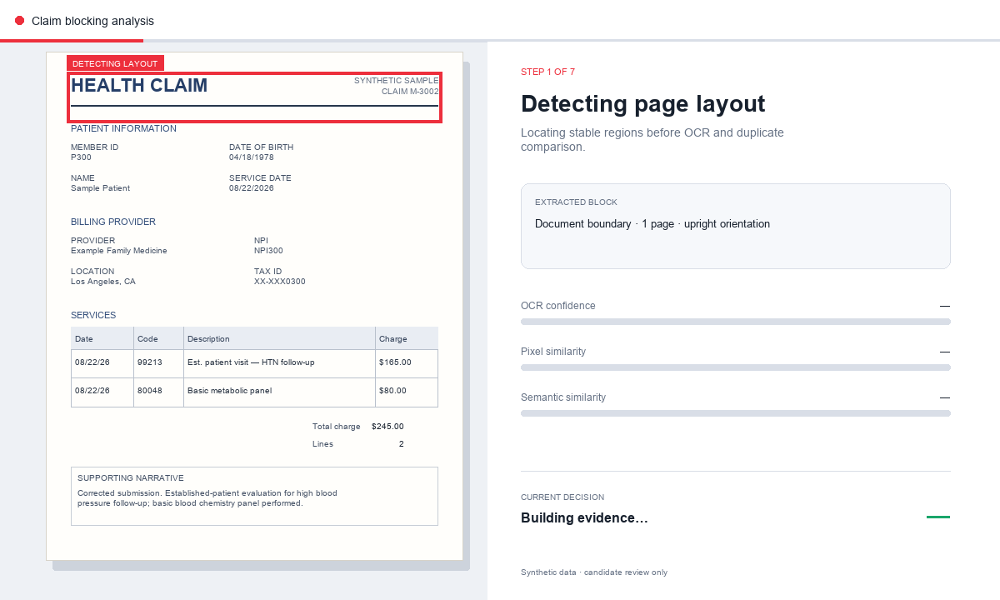

# This wasnt used but provides basis for tabale aware parsing which is used. 
 
Did not know LLMs could do this. 

# Claim Blocking Analysis Demo

An animated synthetic claim-processing example showing OCR block detection, positional pixel comparison, semantic similarity, and duplicate-candidate scoring.



The red box advances through patient, provider, service-line, total, and narrative blocks. The example is for candidate review and does not make payment or denial decisions.

## Block embeddings

Each of the five document blocks has a reproducible 1,024-dimensional, L2-normalized character n-gram embedding. This matches the repository's OCR-noise-tolerant approach while using stable hashing across processes.

```bash
python work/calculate_block_embeddings.py
```

Generated files:

- `outputs/block_embeddings.json` — dense vectors, block text, normalized coordinates, and checksums
- `outputs/block_embedding_summary.csv` — one summary row per block
- `outputs/block_embedding_cosine.csv` — block-to-block cosine similarity matrix
