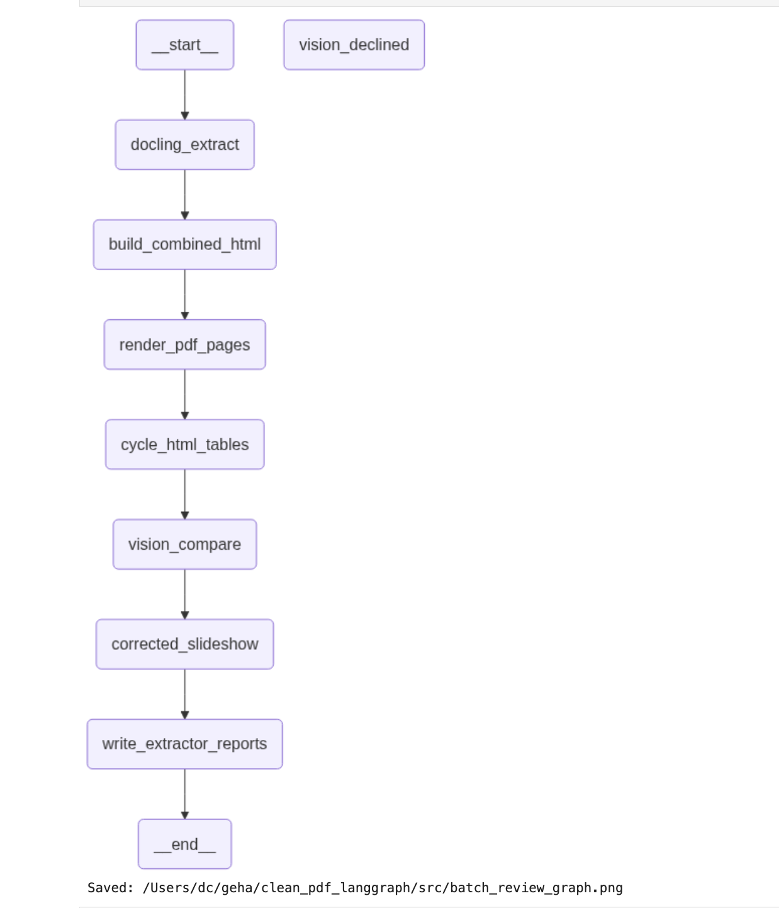
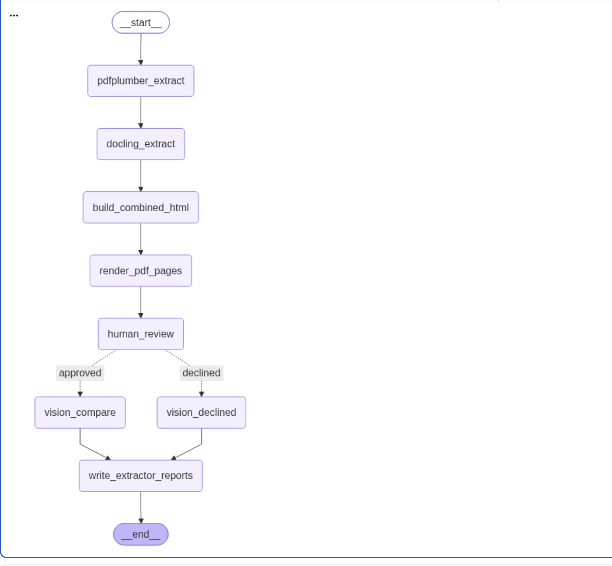

# GEHA clean PDF LangGraph

This project extracts tables from GEHA coverage-policy PDFs with Docling, renders source PDF pages, compares extracted HTML tables against the source images, and writes review artifacts for each PDF.





## Workflow

The batch graph performs these steps:

1. Extract the PDF with Docling.
2. Export the Docling Markdown, chunks, and table Markdown.
3. Add the nearest preceding Markdown heading to each table.
4. Generate combined HTML table artifacts.
5. Render PDF pages to PNG images.
6. Optionally send page images and HTML tables to the vision model.
7. Correct tables when the vision review identifies an extraction error.
8. Write corrected HTML, review reports, and a batch summary.

The PDF remains the source of truth. Corrected HTML is a review artifact and does not modify the original PDF or Docling Markdown.

## Install

From the repository environment:

```bash
cd /Users/dc/geha
uv sync
```

The SQLite checkpoint dependency is required when running the batch workflow. Graph visualization itself does not require opening a checkpoint.

## Run the 32-policy batch

Start a fresh run:

```bash
cd /Users/dc/geha/clean_pdf_langgraph

/Users/dc/geha/.venv/bin/python -m src.batch_review_graph \
  --input-dir /Users/dc/geha/downloads/coverage-policies
```

To prevent the slideshow from opening while still producing screenshots and corrected HTML:

```bash
GEHA_NO_BROWSER=1 \
/Users/dc/geha/.venv/bin/python -m src.batch_review_graph \
  --input-dir /Users/dc/geha/downloads/coverage-policies
```

Each run is written to a new directory under `review_runs/`.

## Review corrected HTML

After a successful run, cycle through only corrected HTML files:

```bash
/Users/dc/geha/.venv/bin/python artifact_slideshow.py \
  --directory /Users/dc/geha/clean_pdf_langgraph/review_runs/<run-directory> \
  --recursive \
  --corrected-only \
  --interval 1 \
  --port 8765
```

Open `http://127.0.0.1:8765` in a browser.

## Graph visualization notebook

Open `src/batch_review_graph_visualization.ipynb` to import the current graph, print its Mermaid representation, and regenerate the PNG visualization.

```bash
cd /Users/dc/geha/clean_pdf_langgraph
/Users/dc/geha/.venv/bin/jupyter notebook src/batch_review_graph_visualization.ipynb
```

## Output files

Each PDF output directory can contain:

- `<policy>.docling.md` — Docling Markdown export
- `<policy>.docling_chunks.md` — chunked text with provenance
- `<policy>_docling_tables.md` — extracted tables with nearest headings
- `<policy>_docling_tables.html` — first-pass HTML tables
- `<policy>_docling_tables_corrected.html` — corrected HTML tables
- `<policy>_images_<page>.png` — rendered PDF pages
- `<policy>_docling_errors.md` — visual review report
- `checkpoint.sqlite` — LangGraph checkpoint state

The batch-level `batch_summary.json` records the status and output directory for every PDF.
