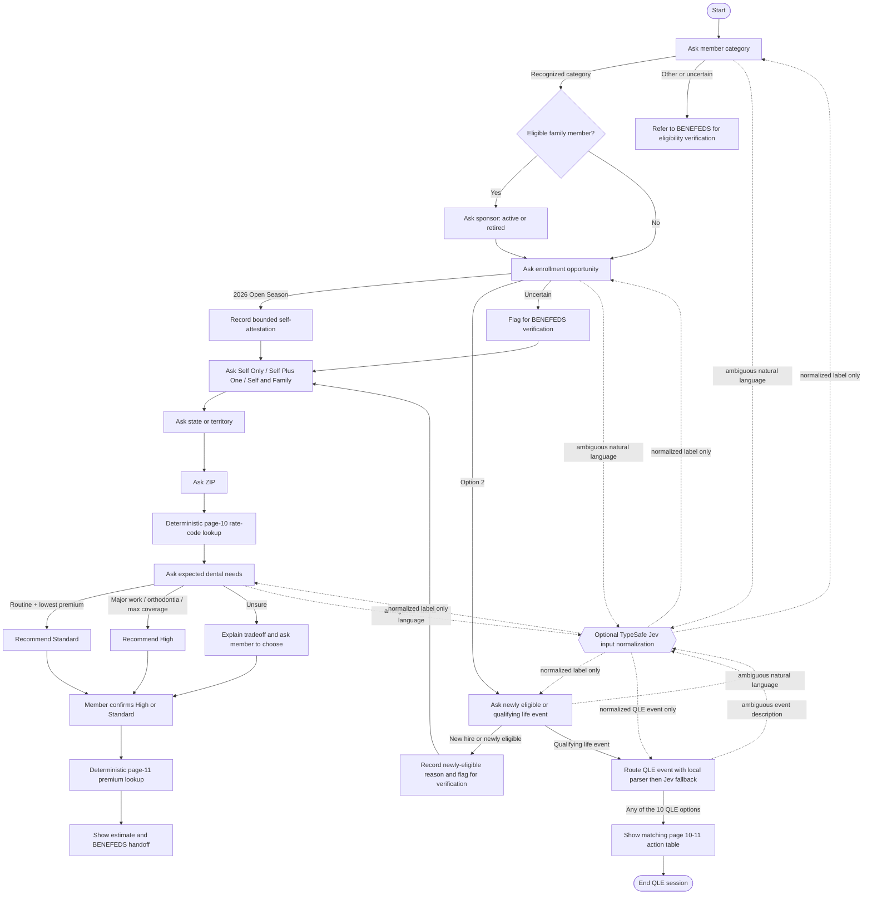

cd /Users/dc/geha/dental_enrollment_chatbot
source /Users/dc/geha/.venv/bin/activate
streamlit run src/app.py


This is an enrollment agent for a dental policy. 

The document is: 2026-geha-dental-benefits-guide_pages

The benefits guide supports the recommendation and pricing logic, but it does not contain the full legal FEDVIP eligibility rules. I’m therefore making eligibility a bounded self-attestation: clearly listed federal-member categories proceed, uncertain cases are flagged for BENEFEDS verification, and the app never claims to perform official enrollment. Plan recommendation and premiums remain deterministic from guide pages 4–11.

This was deliberately kept separate from the other chatbots. WHen combined with a benefit question chatbot the graph became too complicated to understand. 

The point of this demo is to distinguish vector search vs. the state machine algorithm in a dental policy. If we naively chunk the dental membership document into a vector database and build a chatbot around it; it wouldn't work well. This is because there is an mismatch between a vector similarity search and the process of matching a member to a policy. 

We call this xxx. 

## Run

```bash
cd /Users/dc/geha/dental_enrollment_chatbot
source /Users/dc/geha/.venv/bin/activate
streamlit run src/app.py
```

The deterministic chatbot works without an API key. To enable TypeSafe Jev as
an optional natural-language normalizer, set `TYPESAFE_API_KEY` before starting
Streamlit. Jev is called only when local parsing cannot understand the member's
answer. It never decides eligibility, chooses a rate code, recommends a plan,
or generates a premium.

## Enrollment state machine



The Streamlit sidebar also shows the Mermaid representation generated by the
compiled LangGraph.

Every QLE option is terminal. Selecting any of the 10 events immediately shows
that event's five-action row from brochure pages 10–11—new enrollment,
increase, decrease, cancel, and change plan—then ends the session. The chat
input remains disabled until the user explicitly clicks **Start over**. The
displayed table is generated from the local `QLE_MATRIX`.

## Recommendation rules

| Member need | Recommendation | Guide basis |
|---|---|---|
| Preventive/routine care and lowest premium | Standard | Pages 4 and 7 |
| Upcoming major dental work | High | Pages 4–6; lower member shares on Classes B and C |
| Orthodontia | High | Page 5; 30% and $3,500 lifetime maximum versus Standard's 50% and lower maximums |
| Unlimited annual maximum, maximum coverage, or third adult cleaning | High | Pages 5–6 |
| Unsure | Compare, then let the member select | The app does not invent preferences |

The result is a recommendation, not an assignment by GEHA or BENEFEDS.

## Source-of-truth boundaries

The app reads the local extracted guide at runtime:

- `page-004.md`: High versus Standard positioning.
- `page-005.md`: Class A–D cost shares, deductibles, and annual maximums.
- `page-006.md`: High plan features.
- `page-007.md`: Standard plan features.
- `page-010.md`: state/ZIP-prefix to rate-code table.
- `page-011.md`: employed-biweekly and retired-monthly premiums.
- `page-012.md`: BENEFEDS enrollment instructions.

The benefits guide describes eligible audiences but is not a complete legal
eligibility policy. Unknown categories stop with a BENEFEDS referral; newly
eligible and QLE paths can continue to an estimate but remain visibly flagged
for verification.

## Project files

- `src/enrollment_graph.py`: LangGraph state, prompts, transitions, and recommendation.
- `src/guide_tables.py`: local parsing and lookup for pages 10–11.
- `src/jev_router.py`: optional fail-closed TypeSafe Jev normalizer.
- `src/app.py`: Streamlit chat UI and graph viewer.
- `src/test_enrollment_graph.py`: rule, table, flow, and Jev-boundary tests.

## Test

```bash
cd /Users/dc/geha/dental_enrollment_chatbot
PYTHONPATH=src /Users/dc/geha/.venv/bin/python -m unittest -v src/test_enrollment_graph.py
```
