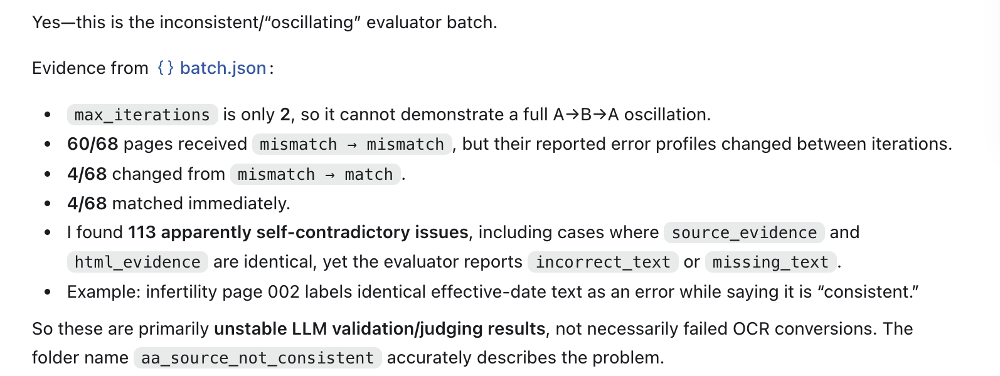

# Error oscillation

This batch demonstrates inconsistent LLM validation across repeated evaluation passes (`error_oscillation`). Reported error types and counts change between iterations, and some reported issues contain identical source and HTML evidence.

