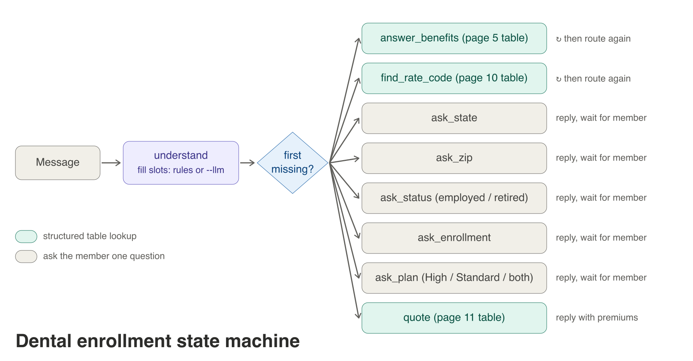
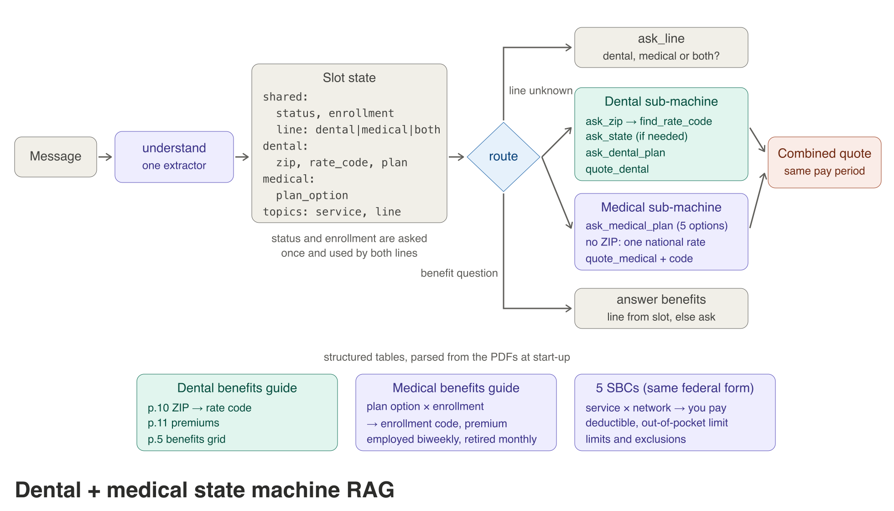

# e2e_RAG

This project includes PDF loading, chunking, Chroma retrieval, optional query
expansion and reranking, answer generation, and an optional offline Ragas
evaluation command.

## Install

```bash
cd /Users/dc/geha/e2e_RAG
uv pip install -r requirements.txt
```

Set `OPENAI_API_KEY` in the environment before using OpenAI generation or
evaluation models.

## Run the Ragas evaluation

Copy `evals/questions.example.jsonl` and replace its sample content with
approved questions and reference answers. Each JSONL record requires
`user_input` and `reference`; `reference_contexts` is optional.

```bash
cd /Users/dc/geha/e2e_RAG/src
python evaluate_ragas.py \
  --pdf ../data/2306.02707.pdf \
  --dataset ../evals/questions.example.jsonl \
  --output ../evals/results.json \
  --reranker-model none
```

The report contains per-question and mean scores for:

- `faithfulness`: whether claims in the answer are supported by retrieved text.
- `answer_relevancy`: whether the answer addresses the question.
- `context_precision`: whether useful passages are ranked ahead of noise.
- `context_recall`: whether the retrieved passages contain the reference facts.

Ragas is kept out of the normal CLI and Streamlit answer path. Evaluation makes
additional evaluator-model and embedding API calls, so run it deliberately on
a versioned test set rather than on every user request.

The project pins Ragas 0.4.3. That release imports a LangChain Vertex AI
compatibility module that modern `langchain-community` removed, so the local
adapter supplies the optional import only for Ragas. This evaluation uses
OpenAI and does not install or invoke Vertex AI.

## Test

```bash
cd /Users/dc/geha/e2e_RAG/src
python -m unittest test_class_refactor test_ragas_evaluator
```

## Agentic RAG


`src/agentic_rag.py` wraps `RagClient` in a LangGraph loop in the style of Corrective
RAG (`data/2401.15884v3.pdf`) and Self-RAG (`data/2310.11511v1.pdf`). It reuses the
client's parent-document retriever, reranker and answer chain; no existing file changes.

1. **Retrieve** with the parent-document retriever, then the reranker (`none` or `gpt`).
2. **Grade** each passage with a structured-output call (`relevant: bool`) and keep the relevant ones.
3. **Rewrite** the search query if none is relevant and retrieve again, at most twice;
   after that, **give up** with "I could not find this in the documents." rather than
   answer from weak passages.
4. **Generate** with the existing answer chain, always from the original question.
5. **Check** that every claim is supported by the passages; if not, regenerate (at most two
   generations in total).

`AgenticRag.generate()` returns the same keys as `RagClient.generate()` (`response`,
`contexts`, `retrieved_contexts`) plus `grounded` and a `trace` of the steps taken.

```bash
cd /Users/dc/geha/e2e_RAG/src
python agentic_rag.py --pdf ../data/2310.11511v1.pdf "What reflection tokens does Self-RAG use?"
python -m unittest test_agentic_rag      # fakes only: no API key, model download or PDF
python evaluate_agentic.py --pdf ../data/2306.02707.pdf \
  --dataset ../evals/questions.example.jsonl --output ../evals/results_agentic.json
```

The unit tests cover: answering once when the first retrieval is relevant, rewriting
when nothing is relevant, giving up after two rewrites, regenerating an ungrounded
answer, bounding regeneration, and answering the original question rather than the
rewritten query. `evaluate_agentic.py` produces the same Ragas report as
`evaluate_ragas.py`, plus `agent_steps` (how often it retrieved, rewrote, regenerated or
gave up), so the two pipelines can be compared on one dataset. Add vaguely worded and
unanswerable questions to the dataset to exercise the rewrite and give-up paths.

Cost: grading makes one LLM call per retrieved passage, plus the answer and the check, so a
question costs several times the plain pipeline. Pass a cheaper model for those calls with
`AgenticRag(client, llm=ChatOpenAI(model_name="gpt-4o-mini"))`.

## Dental enrollment chatbot (structured RAG, state machine)



`src/dental_enrollment.py` quotes 2026 G.E.H.A FEDVIP dental premiums and answers
benefit questions from `/Users/dc/geha/downloads/dental/fedvip/2026-geha-dental-benefits-guide.pdf`
(override with `DENTAL_GUIDE`). It is structured RAG: the answers come from tables, not
from passages found by similarity search.

- **Tables** (`src/dental_tables.py`): page 10 (state and first three ZIP digits ->
  rate code 1-5) and page 11 (plan, employed biweekly or retired monthly, enrollment
  type, rate code -> premium) are parsed from the PDF at start-up. The page 5 benefits
  grid is a dict whose every value the tests find in the PDF text.
- **State machine** (LangGraph, one pass per message, slots kept per thread by a
  checkpointer): `understand` fills slots from the message, then the router goes to the
  first missing step, following the guide's own steps: ZIP -> rate code -> employed or
  retired -> enrollment type -> plan -> quote. A benefit question is answered from the
  table and the conversation continues. Changing any slot re-quotes; "start over" resets.
- **ZIP to state**: the PDF keys rows by state, so the ZIP prefix is mapped to its
  state(s) with the USPS prefix ranges, plus any state whose row lists that prefix (for
  example 205 appears under DC, MD and VA). If those states share a rate code, no question
  is asked; if they differ, the bot asks which state.
- **Models**: none by default; replies are parsed by rules. `--llm` adds an OpenAI
  structured-output call to parse free-form replies (needs `OPENAI_API_KEY`). The model
  only fills slots; it never writes a rate code, premium or benefit.

```bash
cd /Users/dc/geha/e2e_RAG/src
python dental_enrollment.py          # chat in the terminal, rules only
python dental_enrollment.py --llm    # OpenAI parses replies
python -m unittest test_dental_enrollment
```

```text
you> my zip is 20500
ZIP 20500 (DC/MD/VA) is rate code 4 (guide page 10: DC | Entire state | 4).
Are you an active federal employee (biweekly premiums) or a retiree (monthly premiums)?
you> I'm retired, me and my wife, compare both
2026 premiums for a retiree, Self Plus One, rate code 4 (guide page 11):
  High: $112.84 monthly
  Standard: $64.13 monthly
```

The tests check the PDF-parsed tables against the earlier CSV extraction in
`downloads/dental/fedvip/` (90 rate-code rows, 60 premiums), that every benefit value is
printed in the guide, rate-code look-ups (including shared and unknown ZIP prefixes), and
the conversation: slot order, a one-message quote, a benefit question mid-flow, a bad ZIP,
re-quoting after a change, a new ZIP, and start over. The guide's enrollment dates (Open
Season November 10 to December 8, 2025) are quoted as printed; check current dates
before using this with members.

## Dental + medical chatbot



`src/benefits_bot.py` extends the dental state machine to FEHB medical, with a chat
interface in `src/benefits_chat_app.py` (Streamlit; the sidebar shows the slot state).

- **Shared slots**, asked once: which line (dental, medical or both), employed or
  retired, enrollment type. Dental adds ZIP -> rate code -> dental plan; medical adds the
  plan option. FEHB premiums are national, so medical never asks for a ZIP.
- **Medical tables** (`src/medical_tables.py`, PDFs in
  `/Users/dc/geha/downloads/medical/fehb`, override with `FEHB_DIR`):
  - premiums and enrollment codes for the five plan options (Elevate, Elevate Plus, HDHP,
    Standard, High) from the FEHB medical benefits guide, e.g. "Self Only CODE 251
    Elevate Plus $205.13 $444.45" (employed biweekly, retired monthly);
  - each plan's Summary of Benefits and Coverage grid. The SBC is a federal form, so one
    parser reads all five by position: the drawn row rules give the rows, the column
    headings give in-network / out-of-network / limitations. Each SBC yields the same 30
    services. Deductible and out-of-pocket limit come from page 1.
- **Coexistence rules**: High and Standard exist in both lines, so they go to the plan
  question being asked, the line named in the message, or the only line chosen; Elevate,
  Elevate Plus and HDHP are medical only. "Deductible" and "x-ray" exist in both, so if the
  line is unknown the bot asks which. A quote for both lines adds a total for the same
  pay period (biweekly employed, monthly retired) when one plan of each is chosen.
- Parsing the PDFs is deterministic (PyMuPDF text and drawing positions, no model);
  parsing messages is rules, like the dental bot.

```bash
cd /Users/dc/geha/e2e_RAG/src
streamlit run benefits_chat_app.py      # web chat
python benefits_bot.py                  # terminal chat
python -m unittest test_benefits_bot
```

The tests check the 15 premiums, that all five SBCs give the federal form's 30 rows, that
every parsed cell is printed in its SBC, spot values (e.g. Elevate Plus specialist
$50* / visit, HDHP emergency room 5% coinsurance), how High/Standard and shared topics are
routed, the conversations (both lines with one total, medical without a ZIP, adding a
line later, a deductible question before the line is known), that every dollar in a
quote is a table value, and the Streamlit app through `streamlit.testing`.

### On Vercel

[`benefits_vercel/`](benefits_vercel/README.md) is the same bot as a Vercel app: a static
chat page plus one Python function (`POST /api/chat`). The page carries the conversation
state, the PDF tables ship as `tables.json`, and the only runtime dependency is LangGraph.
Run it locally with `benefits_vercel/local_server.py`; deploy with Root Directory
`e2e_RAG/benefits_vercel`.

### Conversation test set

`evals/benefits_conversations.jsonl` has 52 conversations written the way members talk
("I'm an annuitant", "my husband and two kids", "the high deductible plan", typos,
changing their mind, adding a line later, benefit questions mid-flow), each with the
slots a careful human would fill. Rate codes in the expectations come from the page 10
table. `evals/run_benefits_conversations.py` plays each one through a fresh bot thread
and scores:

- **joint goal accuracy**: every expected slot right (one wrong slot means a wrong premium);
- **quote accuracy**: the last reply holds every premium the expected slots imply;
- **expected phrases**: benefit answers given mid-flow.

```bash
cd /Users/dc/geha
PYTHONPATH=e2e_RAG/src .venv/bin/python e2e_RAG/evals/run_benefits_conversations.py
```

It writes `evals/benefits_conversations_results.json` and `.md` (scores, per-slot and
per-category tables, and every failure with what the member said).

Baseline with the rules parser (2026-10-02): **37/52 conversations fully right (71%)**.
Slots: ZIP 100%, status 94%, enrollment 94%, line 90%, medical plan 88%, rate code 83%,
dental plan 72%. Every benefit answer expected mid-flow was given. The misses:

- "both" as the first message is not read as dental and medical (it only counts after the
  bot asks), which breaks 4 conversations;
- "FEHB and FEDVIP" is read as medical only;
- wording the rules lack: "postal worker", "still working", "individual coverage",
  "the cheaper one", "high dental and standard medical";
- "me and my daughter" / "me and my son" is read as Self and Family; one family member
  is Self Plus One;
- typos: "retierd", "elevat plus", "standrad".

`docs/conversation_replay.html` replays the test set with the bot's actual replies: one
message every 5 seconds, a pass/fail badge and the wrong slots for each conversation,
looping through all 52 (Pause, Prev and Next buttons). It is built from
`benefits_conversations_results.json`, so re-run the runner and rebuild it after changes.
Open it through a local server, e.g. `python3 -m http.server -d docs 8512`, then
http://localhost:8512/conversation_replay.html.

Fix these by changing the rules or adding the `--llm` parser, then re-run; keep the set
fixed so the score is comparable, and add new conversations from real member wording as
a separate set so the bot is not tuned to the test.

## Retrieval benchmark

The retrieval-only benchmark exercises the actual dense parent-document path:
PDF extraction, token-aware parent/child chunking, BGE embeddings, Chroma
maximum-inner-product retrieval, and parent lookup. It does **not** call an
answer-generation model or Ragas, so its metrics isolate retrieval behavior.

The versioned fixture contains 14 grounded questions over seven tracked PDFs.
Gold labels are source filenames. Because several parent chunks can come from
one PDF, retrieved chunks are deduplicated by source before calculating:

| Metric | Meaning |
|---|---|
| Recall@5 | Fraction of relevant source PDFs found in the first five unique sources |
| MRR@10 | Reciprocal rank of the first relevant source, capped at rank 10 |
| nDCG@10 | Position-discounted ranking quality for all relevant sources through rank 10 |
| Latency | Median and p95 retriever query time; model loading and indexing are excluded |

Run the production BGE profile used in CI:

```bash
cd /Users/dc/geha
PYTHONPATH=e2e_RAG/src \
  .venv/bin/python e2e_RAG/evals/retrieval_benchmark.py \
  --embedding-model BAAI/bge-large-en-v1.5 \
  --out e2e_RAG/evals/retrieval_results

.venv/bin/python e2e_RAG/evals/check_retrieval_thresholds.py \
  e2e_RAG/evals/retrieval_results.json
```

For a faster development-only comparison, replace the model argument with
`BAAI/bge-small-en-v1.5`. Do not compare its latency directly with the large
model's CI baseline.

Observed local baseline on the 14-question fixture (2026-09-30):

| Embedding profile | Recall@5 | MRR@10 | nDCG@10 | Median latency |
|---|---:|---:|---:|---:|
| `BAAI/bge-large-en-v1.5` | 1.0000 | 1.0000 | 1.0000 | 86.9 ms |
| `BAAI/bge-small-en-v1.5` | 1.0000 | 0.9643 | 0.9736 | 14.8 ms |

CI gates are intentionally below that baseline: Recall@5 ≥ 0.90, MRR@10 ≥
0.80, nDCG@10 ≥ 0.82, and median latency ≤ 2,000 ms. The broad latency budget
allows for shared GitHub CPU runners while still catching severe regressions.
The workflow publishes both JSON evidence and a Markdown summary as artifacts.
