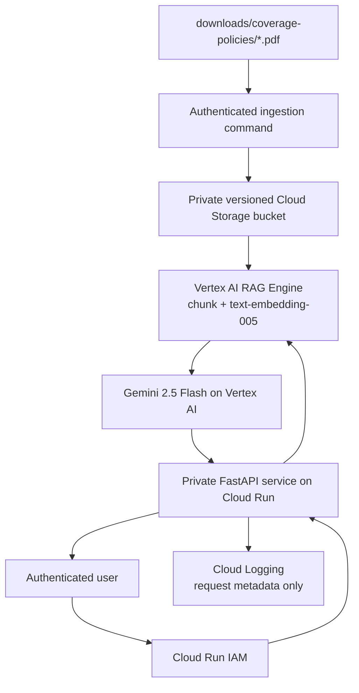

# GCP Vertex AI enterprise RAG sample

This project turns the existing PDFs in `../downloads/coverage-policies` into a
small, production-shaped Google Cloud RAG application. It is intentionally
separate from `../aws_rag`: the AWS implementation remains the working benchmark,
while this directory demonstrates the corresponding GCP architecture.

The source documents are the repository's demonstration coverage policies. Do not upload
member, claim, clinical, PHI, PII, or other restricted data to this sample.

## Architecture



Implemented enterprise controls:

- Cloud Run is private by default; Terraform never grants `allUsers` access.
- Runtime and ingestion use separate service accounts and Application Default
  Credentials. There are no model API keys or service-account key files.
- The document bucket blocks public access, uses uniform IAM, and keeps versions.
- The model receives retrieved evidence as untrusted content and must cite sources.
- Empty retrieval results abstain instead of asking the model to invent an answer.
- Logs contain request IDs, status, and citation counts—not questions or evidence.
- Tests replace all cloud clients, so CI requires no GCP credentials or network.
- Container execution uses a non-root user and bounded Cloud Run scaling.

Still required for a regulated enterprise deployment:

- organization landing zones, separate dev/test/prod projects, VPC Service Controls,
  restricted egress and organization policies;
- workforce SSO/IAP and document-level authorization based on trusted identity;
- approved PHI handling, DLP inspection, retention, CMEK decisions and audit policy;
- evaluation/promotion thresholds, security testing, SLOs, alerting and disaster
  recovery exercises. This sample is not evidence of HIPAA or HITRUST compliance.

## Project layout

| Path | Purpose |
|---|---|
| `app/` | FastAPI UI/API, Vertex RAG retrieval and Gemini generation |
| `ingest/` | Idempotent PDF upload and managed-corpus import |
| `terraform/` | Bucket, Artifact Registry, identities, IAM and private Cloud Run service |
| `tests/` | Offline API, grounding, abstention and ingestion tests |
| `cloudbuild.yaml` | Test, container build and immutable image push |

## 1. Run tests locally

```bash
cd /Users/dc/geha/gcp_vertex_rag
uv run --no-project --python 3.12 \
  --with-requirements requirements-dev.txt \
  python -m unittest discover -s tests -v
```

## 2. Prepare Google Cloud

Choose or create a project with billing, then authenticate both the CLI and local
Application Default Credentials:

```bash
export PROJECT_ID=your-project-id
export REGION=us-central1
gcloud auth login
gcloud auth application-default login
gcloud config set project "$PROJECT_ID"
gcloud services enable \
  aiplatform.googleapis.com artifactregistry.googleapis.com \
  cloudbuild.googleapis.com iam.googleapis.com run.googleapis.com \
  storage.googleapis.com
```

Use Terraform to create the bucket and identities first. Because Cloud Run needs
an existing image and corpus, initial provisioning is deliberately two-phase.

```bash
cd terraform
terraform init
terraform apply -target=google_storage_bucket.documents \
  -target=google_artifact_registry_repository.app \
  -target=google_service_account.runtime \
  -target=google_service_account.ingest \
  -target=google_project_iam_member.runtime_vertex \
  -target=google_project_iam_member.ingest_vertex \
  -target=google_storage_bucket_iam_member.ingest_documents \
  -var="project_id=$PROJECT_ID" \
  -var="image=us-central1-docker.pkg.dev/$PROJECT_ID/vertex-rag/api:bootstrap" \
  -var="rag_corpus_name=bootstrap"
export BUCKET="$(terraform output -raw document_bucket)"
cd ..
```

For a real organization, run ingestion as the dedicated ingestion service account
through Workload Identity Federation. For a developer demo, your ADC principal
needs Storage Object Admin on this bucket and Vertex AI User in the project.

## 3. Upload and index the existing PDFs

```bash
uv run --no-project --python 3.12 \
  --with-requirements requirements-dev.txt \
  python -m ingest \
    --project "$PROJECT_ID" \
    --location "$REGION" \
    --bucket "$BUCKET" \
    --source ../downloads/coverage-policies
```

The command uploads only `*.pdf`, adds a SHA-256 metadata value, skips unchanged
objects, creates or reuses `geha-coverage-policies-demo`, and prints its full
resource name. Save that value:

```bash
export RAG_CORPUS='projects/.../locations/us-central1/ragCorpora/...'
```

Rerunning the command is safe for Cloud Storage. Vertex RAG import behavior and
charges still apply; use `--upload-only` when you only want to synchronize files.

## 4. Test the API locally against Vertex AI

```bash
export GOOGLE_CLOUD_PROJECT="$PROJECT_ID"
export GOOGLE_CLOUD_LOCATION="$REGION"
export VERTEX_RAG_CORPUS="$RAG_CORPUS"
uv run --no-project --python 3.12 \
  --with-requirements requirements.txt \
  uvicorn app.main:app --reload
```

Open `http://127.0.0.1:8000`. The health endpoint is `/healthz`; grounded requests
use `POST /api/chat` with `{"question":"..."}`.

## 5. Build and deploy privately

```bash
export IMAGE_TAG="$(git rev-parse --short HEAD)"
gcloud builds submit --config cloudbuild.yaml \
  --substitutions="_IMAGE=$REGION-docker.pkg.dev/$PROJECT_ID/vertex-rag/api,_TAG=$IMAGE_TAG"
export IMAGE="$REGION-docker.pkg.dev/$PROJECT_ID/vertex-rag/api:$IMAGE_TAG"

cd terraform
terraform apply \
  -var="project_id=$PROJECT_ID" \
  -var="image=$IMAGE" \
  -var="rag_corpus_name=$RAG_CORPUS" \
  -var='invoker_members=["user:you@example.com"]'
```

Cloud Run returns `403` to unauthenticated callers. For a developer test:

```bash
gcloud run services proxy geha-vertex-rag --region "$REGION"
```

Then open `http://127.0.0.1:8080`.

## Retrieval behavior

The service requests the top six RAG Engine passages and supplies numbered
evidence to Gemini. The response includes the answer plus source URIs. It does
not claim that a citation proves the answer; a production evaluation must verify
citation correctness, retrieval recall, groundedness, latency and cost against a
versioned question set before promotion.

This first slice uses RAG Engine's managed PDF parser. It does **not** yet use the
Docling table chunks, figure descriptions, BM25 fusion, or reranker evaluated in
`../aws_rag`. Run the same coverage-policy test set against both systems before
making any quality or cloud-parity claim; table-heavy questions are the most
important regression group.

This architecture follows Google's current RAG Engine pattern: Cloud Storage
sources, a managed corpus, explicit chunking, retrieval, and grounded Gemini
generation. RAG Engine availability and security-control support vary by region
and feature, so verify the selected region and compliance requirements before use.
