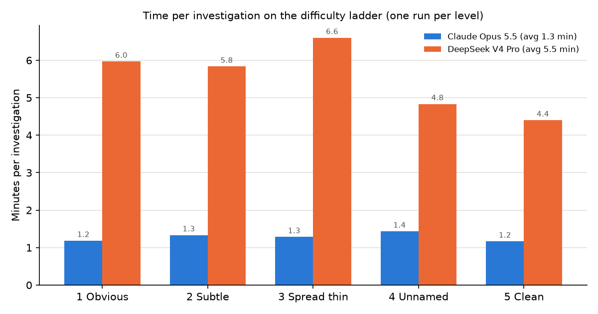

# Claims fraud investigation: agent + live trace

> **Teacher-guided prompt and tool optimization.** This project improves the agent
> configuration around DeepSeek; it does not retrain or recursively improve the
> DeepSeek model itself.

First, a stronger teacher agent explores seeded fraud cases and establishes a baseline.
Then DeepSeek runs different cases, its findings are graded against answer keys, and
Claude Opus converts the observed mistakes into general lessons and, optionally,
proposed analytics tools. Lessons are retained only when they improve a held-out test
score. Proposed tools require human approval before the agent may call them.

## What "self-improving" means here

```text
DeepSeek investigates a synthetic case
                 ↓
Results are graded against known outcomes
                 ↓
Claude Opus analyzes misses and false accusations
                 ↓
Opus revises reusable lessons or proposes a tool
                 ↓
DeepSeek is tested on different held-out cases
                 ↓
Keep the change only when the held-out score improves
```

What changes:

- `lessons.md`, which is appended to the agent prompt;
- optionally, sandboxed Python analytics tools proposed for human approval; and
- the agent's search behavior because it receives the accepted lessons and tools.

What does **not** change:

- DeepSeek's model weights, training data, architecture, or inference algorithm;
- the base system prompt in `agent.py`; or
- the requirement for answer keys, a stronger external reflector, and human approval
  of generated tools.

Therefore this is not autonomous recursive self-improvement (RSI), model training, or
teacher-student distillation. The precise description is **teacher-guided prompt and
tool optimization with held-out evaluation**. It is reasonable to call the overall
agent system iteratively improving, but not to claim that DeepSeek itself learns.

> Files: `improve.py` (the loop), 
> Files: `lessons.md` (the lessons the agent has learned and that passed the test), 
> Files: `learned.py` and 
> Files: `learned_tools/` (tools the agent writes for itself, held for approval), 
> Files: `seed_fraud.py --variant N` (same schemes, different providers, patients and dates) 
> Files: `lessons` / `variant` arguments in `agent.py` and
> Files: `ladder.py`. 
> run `python3 ../fraud/seed_fraud.py --reset`
> `python3 ../fraud/seed_fraud.py --level 1` afterwards to restore the original demo.

Step 1: Run the stronger model for a benchmark and where to get the weaker model to improve to. 
A LangGraph agent (Claude Opus 5.5) investigates  HAPI claims data for billing
fraud, choosing among raw FHIR tools (via the langcare MCP server) and claims-analytics
tools. Every step streams to a React app: Claude's reasoning summary, the tool it picked
and its arguments, the result, timings, and the final findings scored against a planted
answer key. **Synthetic data only.**

```
React UI (ui/)  ──SSE──►  server.py (FastAPI :8765)  ──►  agent.py (LangGraph)
                                                          ├─ fhir_search / fhir_read ──MCP──► langcare-mcp-fhir ──► HAPI
                                                          └─ analytics tools (tools.py) ─────────────────────────► HAPI
```

## Run

```bash
cd /Users/dc/geha/hapi && docker compose up -d        # HAPI with the Synthea data (see ../README.md)
cd fraud
python3 seed_fraud.py --level 1                       # plant level 1 (see the ladder below); writes answer_key.json
(cd ui && npm install && npm run build)               # React app -> ui/dist
./run_server.sh                                       # http://localhost:8765  (needs ANTHROPIC_API_KEY)
```

`run_server.sh` uses `uv` to run the server with langgraph, langchain-anthropic,
langchain-mcp-adapters, fastapi and uvicorn, and reads `ANTHROPIC_API_KEY` from the
environment (or `../../bill_lading/.env`). For UI development, `cd ui && npm run dev`
(port 5173, proxies `/api` to 8765). `python3 seed_fraud.py --reset` removes the planted
records.

## The planted fraud (`seed_fraud.py`)

Synthea's claims contain no fraud, so the script adds two made-up providers with 77
claims (ExplanationOfBenefit) built in the same shape as Synthea's. Nothing in the FHIR
data marks them; `answer_key.json` (git-ignored, ids differ per server) has the truth.

| Provider | Scheme | Planted |
|---|---|---|
| Dr. Vincent Grayle, Summit Ridge Wellness Clinic | upcoding | 45 "Consultation for treatment" claims paid ~5-7x the peer median ($102.58) |
| | impossible day | 26 one-hour visits between 07:00 and 20:00 on 2026-03-12 |
| Dr. Lena Moravec, Heartland Home Health | billing after death | 12 home visits for 3 deceased patients, 1-10 months after death |
| | duplicate billing | 10 visits each submitted twice (same patient, day, service, amount) |

**Why each level is harder.** The amount of data barely changes: every level searches the same
4,073 genuine Synthea claims plus whatever is planted. What changes is how small the fraud is
against that background, and how many kinds of fraud the agent has to think of.

| Level | Planted claims | Share of all claims |
|---|---:|---:|
| 1 Obvious | 77 | about 1.9% |
| 2 Subtle | 65 | about 1.6% |
| 3 Spread thin | 12 | about 0.3% |
| 4 Unnamed | 214 | about 5% |
| 5 Clean | 0 | 0% |

- **The signal weakens (level 2):** the fraud is still there in volume, but each claim is only
  slightly abnormal (1.6x instead of 6x pricing; one day apart instead of the same day, which
  the exact-date duplicate tool misses).
- **The needle shrinks (level 3):** 12 claims spread across six real providers, two or three
  each, inside genuine billing histories, with no new suspicious-looking providers.
- **The hypothesis space grows (level 4):** the most claims are planted, but no tool matches
  the schemes. At levels 1-3 the agent only has to run the right checks; at level 4 it must
  first imagine what unbundling or a phantom patient would look like, then build that check
  from raw searches.
- **The answer can be "nothing" (level 5):** the agent must search everything and still
  conclude there is no fraud, which tests restraint rather than detection.

So the search space of claims stays the same; what grows is the space of possible
explanations and the difficulty of telling fraud from normal variation. The levels are not
strictly harder for every model, because levels 4 and 5 test different skills.

## Difficulty ladder (`seed_fraud.py --level N`, `ladder.py`)
The difficulty ladder is created by Claude. 


`seed_fraud.py --level 1-5` plants one level (removing any earlier planting);
`ladder.py` plants each level, runs the agent, scores it and saves the trace
(`ladder_results.json`/`.md`, and the app's **Difficulty ladder** tab).

| Level | What's planted |
|---|---|
| 1 Obvious | upcoding at ~6x peers, a 26-visit day, visits after death, exact duplicates (2 providers) |
| 2 Subtle | upcoding at 1.6x on half of one provider's claims, 14 visits in a 10-hour window, duplicates re-billed **one day later**, visits 2-3 weeks after death |
| 3 Spread thin | six **existing** Synthea providers: one exact duplicate each (3) or three claims at 2.5x their own price (3) |
| 4 Unnamed | schemes no tool covers: unbundling (one blood count billed as 4 tests), weekly therapy for 26 weeks, 12 **phantom patients** (no other history, one address) |
| 5 Clean | nothing |

For the ladder the agent describes schemes in its own words (the scheme names were
removed from its output format) and may report nothing. Scoring (`scoring.py`) is by
provider: guilty providers named, whether the description matches the scheme (keyword
check), and innocent providers accused.

**Results, one run per level (2026-09-30):**

| Level | Guilty found | Schemes described | Innocent accused | Tool calls | Time |
|---|---:|---:|---:|---:|---:|
| 1 Obvious | 2/2 | 4/4 | 0 | 25 | 71 s |
| 2 Subtle | 2/2 | 3/4 | 0 | 21 | 80 s |
| 3 Spread thin | 5/6 | 5/6 | 0 | 24 | 77 s |
| 4 Unnamed | 2/3 | 2/3 | 0 | 31 | 86 s |
| 5 Clean | n/a | n/a | **0** | 33 | 70 s |

- **Level 2:** missed the next-day re-billing (the duplicate tool matches exact dates);
  it did find that provider's visits after death.
- **Level 3:** missed one provider's three 2.5x claims. It flagged the three single
  duplicates at low confidence ("isolated"). It caught one upcoding provider partly
  through a seeding artifact: a cloned claim of a patient who died in 2019, moved to
  2026, also became a claim after death.
- **Level 4:** found unbundling and the weekly therapy with no tool built for either;
  missed the phantom patients.
- **Level 5:** accused no one.

One run per level: treat these as indicative, not rates. Levels 1-3 still map onto the
analytics tools; levels 4-5 are the fairer tests.

The first ladder attempt was invalid: HAPI reuses search results for 60 seconds by
default, so the tools loaded the claims from before the planting and the agent (correctly)
found nothing at level 1. HAPI's search cache is now off (`docker-compose.yml`) and the
tools send `Cache-Control: no-cache`.

## Running the agent on another model (`--model`)

The agent's model is a small registry in `agent.py` (`MODELS`), selectable in the app
(dropdown next to Run), in `ladder.py --model`, and in `POST /api/runs {"model": ...}`:

| Option | Model | Notes |
|---|---|---|
| `claude` (default) | Claude Opus 5.5 (Anthropic API) | summarized reasoning in the trace; tool results capped at 30,000 characters |
| `nous` | `deepseek/deepseek-v4-pro` on [Nous Portal](https://portal.nousresearch.com) (OpenAI-compatible gateway, `https://inference-api.nousresearch.com/v1`) | needs `NOUS_API_KEY` (or `NOUS_KEY`); pick any portal model with `NOUS_MODEL`; override the URL with `NOUS_BASE_URL` |
| `sonnet`, `haiku`, `gpt-4o`, `gpt-5` | Claude Sonnet 5.5, Claude Haiku 4.5, OpenAI | wired but not run on the ladder; the OpenAI options need `OPENAI_API_KEY` |

```bash
python ladder.py --model nous                                      # DeepSeek V4 Pro
NOUS_MODEL=<portal model id> python ladder.py --model nous       # any other portal model
```

Everything else is shared: graph, tools, MCP server, prompt, trace, scoring. The portal
listed no Hermes models on 2026-09-30, so the default is DeepSeek V4 Pro. If a model is
slow to answer, raise `LANGCHAIN_OPENAI_STREAM_CHUNK_TIMEOUT_S` (default 120 seconds).

### Model comparison (2026-09-30)

Same prompt, tools and planted data for every model; one run per level. Each cell is
guilty providers found, then innocent providers accused.

| Level | Claude Opus 5.5 | DeepSeek V4 Pro (Nous) |
|---|---|---|
| 1 Obvious | 2/2, 0 accused | 2/2, 0 accused |
| 2 Subtle | 2/2, 0 accused | 1/2, 6 accused |
| 3 Spread thin | 5/6, 0 accused | 4/6, 1 accused |
| 4 Unnamed | 2/3, 0 accused | 0/3, 6 accused |
| 5 Clean | 0 accused | 8 accused |
| Tool calls per level | 21-33 | 47-90 |
| Time per level | 70-86 s | 4.5-6.5 min |

- **Claude Opus 5.5** found 11 of 13 planted providers and accused no innocent one.
- **DeepSeek V4 Pro** found 7 of 13 and accused 21 innocent providers, 8 of them on the
  clean level, where the prompt says there may be no fraud at all.

One run per level, so single cells may be luck; the false-accusation gap is the consistent
difference.

**Speed.** Minutes per investigation on the same ladder runs:



Opus 5.5 took 1.2-1.4 minutes on every level. DeepSeek V4 Pro took 4.4-6.6 minutes, about 4
times as long. Tool time was about 30 seconds per investigation for both; the rest is the
model generating. DeepSeek took 19-26 model steps per investigation against 7-12 for Opus,
and about 11-17 seconds per step against 3-6. One run per level.

HIPAA may prevent outside LLMs from accessing the data. Anonymizing the data may remove
the evidence signals needed for fraud analysis.

## Self-improvement

The agent's model never changes. What improves is what it is given: its prompt, and
(optionally) its tools. Both are learned from graded runs: every planted case has an answer
key, so after each investigation the loop knows which providers were missed and which
innocent ones were accused.

### Strategy 1: a lessons file added to the prompt (built, run)

```bash
python improve.py --model nous              # DeepSeek V4 Pro: train on variant 1, test on variant 2, levels 1-5
python improve.py --model claude --train 2:1,4:1 --test 2:2,4:2
python ladder.py --lessons --model nous     # use the accepted lessons in an ordinary ladder run
```

1. **Baseline:** the test cases (level:variant) with no lessons.
2. **Train:** each train case is run with the lessons so far and graded. A reflector model
   (Claude Opus 5.5) reads the tool calls, the report and the grading, and rewrites the
   lessons: at most 10, general, with no names, ids, dates or amounts (lessons containing any
   are dropped in code).
3. **Test:** the test cases again, with the lessons appended to the system prompt under
   "Lessons from earlier investigations".
4. **Keep or reject:** score = guilty providers found minus innocent providers accused, so
   accusing everyone does not pay. The lessons are written to `lessons.md` only if the test
   score beats the baseline, otherwise to `lessons_rejected.md`.

A lesson is plain text: a person can read, edit or delete any line, and the base prompt in
`agent.py` is untouched. Advice to call an existing tool differently ("also search a few
days apart") is a lesson and needs no approval.

#### The lessons as the agent sees them

The base system prompt in `agent.py` is never edited. On a run with lessons, this block is
appended to its end: a fixed header from `agent.py` (`LESSONS_HEADER`), then the lines of
`lessons.md`. These are the lessons the DeepSeek V4 Pro loop kept on 2026-09-30 (test score
−11 → 11):

```
Lessons from earlier investigations. Each was written after a past investigation was
graded against confirmed outcomes. Apply them where they fit; they are general guidance,
not facts about the current data:

- Finding one suspicious provider is not a reason to stop. Run every screen on all providers, including low-volume and low-total ones and those already flagged, since one provider may run several schemes. Screens: exact and near duplicates, same-day claim splitting, post-death claims, daily load, price versus peers and versus the provider's own usual price, repetitive schedules, and patient-roster anomalies. Favor breadth over paging through one provider's claims.
- Treat duplicates as confirmed double billing: the same patient, service code and amount submitted more than once on the same day or a few days apart. Also look for claim splitting, where one encounter is billed as several separate paid claims by the same provider on the same day. An exact-duplicate tool will not catch splitting, so group claims by provider, patient and date and report it as its own scheme. Several zero-paid medication or pharmacy lines alongside one paid professional claim are not splitting.
- Do not dismiss an impossible daily workload as a data artifact, but first exclude claims whose long billing periods inflate daily totals and zero-paid ancillary lines that inflate claim counts. Then check encounters with real start and end times on a single day and flag many hour-long paid visits packed into one day. Run this on every provider.
- Look for rigid repetitive schedules: several patients receiving the same service from one provider at a fixed interval (for example weekly) for many months with identical cadence. Real care varies in timing and tapers off, so this suggests billing for services not rendered.
- Look for phantom patients: groups of patients who appear only with one provider, have no other clinical history, share an address, and each have a similar small number of visits. Check patient demographics and whether these patients were seen by any other provider.
- A cluster of claims at a multiple of a provider's usual price for a code is a flag only if that elevated price is unusual among peers. When unrelated providers show the same discrete set of price tiers or identical amounts for a code, treat it as a legitimate fee schedule or dose/unit tiering. Do not accuse on it, even if the EOB shows no quantity field.
- Distinguish legitimate post-death services, such as a death certification filed shortly after death, from visits or treatments billed long after death, and flag only the second kind. For any claim that is anomalous for one reason, also check its price against the provider's usual price and peers for that code, and describe every scheme it shows.
- High total paid concentrated on a single patient is not fraud by itself; expensive ongoing care such as immunotherapy or prenatal care naturally looks like this. Before accusing, confirm that this provider's line prices exceed what other providers are paid for the same codes.
- Do not use identifier formats, facility names or claim dates to decide which providers are suspicious or ordinary. Judge every provider by billing behavior.
- If every screen comes back clean after exclusions, with prices at peer levels, no true duplicates or splitting, only legitimate post-death claims and normal rosters, report no findings rather than forcing a weak accusation.
```

The lines do three jobs:

- **Search wider (lines 1-5):** run every screen on every provider, and look for specific
  patterns (near duplicates, same-day splitting, packed days, rigid weekly schedules, phantom
  patients). This is why DeepSeek's tool calls rose from about 30 to 80-170 per case.
- **Don't accuse on innocent explanations (lines 6-9):** shared fee schedules, expensive
  ongoing care, death certification after death, and identifiers or dates. These target the
  false accusations, which fell from 14 to 0.
- **Permission to find nothing (line 10):** report no findings when every screen is clean.

Lines 2, 4 and 5 describe scheme types that also appear in the test cases (splitting, weekly
schedules, shared addresses): this is why the benchmark shows learning on recurring schemes,
not discovery of new ones.

### Strategy 2: tool creation (built, run; one revised tool approved)

```bash
python improve.py --model nous --tools      # the loop above, plus tool writing during training
python improve.py --toolsmith <run id>      # write a tool from one saved run in traces/
python learned.py list                      # pending / approved / rejected tools
python learned.py show <name>               # read the code and its check result
python learned.py approve <name>            # only now can the agent call it
```

When a graded run missed a scheme that no existing tool could have surfaced (for example
duplicates re-billed a day later, which the exact-date duplicate tool cannot see), the
reflector writes one new analytics function over the claims table:

1. **Validate** (`learned.validate`): one function `name(rows, names, deaths, ...)` with a
   docstring and typed defaults; imports only from `collections`, `datetime`, `itertools`,
   `json`, `math`, `re`, `statistics`; no `open`, `eval`, underscore attributes, classes,
   `try` or `while`.
2. **Run in isolation** (`learned.run`): a separate Python process with an empty
   environment, a temporary working directory, a reduced set of builtins, an import filter,
   and CPU and 20-second time limits.
3. **Check against the miss:** run with its defaults on the case it was written for, it must
   surface the missed provider, or it is discarded. The number of providers it lists with the
   planted claims removed is recorded, so a reviewer can see how noisy it is.
4. **Stop for approval:** it is saved to `learned_tools/` as **pending**. The agent loads
   only approved tools; a person reads the code (`learned.py show`) and approves or rejects it.

The guard in steps 1-2 is a basic check, not a security boundary, which is why step 4 is
required. A learned tool sees only the claims table (patient, provider, service, date,
minutes, amount); it cannot use patient addresses, so it could not catch phantom patients
who share one. The validator and the isolated runner were also tested offline: a valid
near-duplicate tool passed, and six unsafe snippets, a network import, a file read and a
runaway loop were refused.

#### First tool-writing run (2026-09-30)

`improve.py --toolsmith` on the four DeepSeek V4 Pro training runs that missed schemes
(levels 1-4, variant 1), with Claude Opus 5.5 as the reflector. The code is in
`learned_tools/`. After review on 2026-09-30, `find_next_day_rebills` was approved and the
other two were rejected. `find_next_day_rebills` was then revoked after a test run (below),
and a revised tool, `isolated_next_day_rebills`, was approved and tested. Rejected tools stay in
`learned_tools/` for reference and are never loaded.

| Tool | Written for | Check | Providers listed with the planted fraud removed | Status and review |
|---|---|---|---:|---|
| `find_next_day_rebills` | Level 2: duplicates re-billed one day later | Passed (1 of 2 missed providers surfaced) | 5 | **Approved, then revoked 2026-09-30** after the test run below |
| `split_same_day_claims` | Level 4: one lab visit billed as 4 separate claims | Passed (1 of 3) | 23 | **Rejected.** Noisy: noisy, as Synthea bills pharmacy and procedures as separate same-day claims; output of about 72,000 characters is cut to 30,000 |
| `provider_price_outliers` | Level 3: 3 claims at 2.5x the provider's own usual price | Passed (1 of 1) | 23 | **Rejected.** Noisy: at 2x with a single claim it flags many innocent providers |
| (discarded) | Level 1: a 26-visit day | Failed: did not surface the provider | 2 | Discarded automatically |

- Each tool targets the one scheme in its run that no existing tool covered. The other
  misses (busy days, overpricing against peers) already have tools that DeepSeek did not use
  well; that is a job for lessons, not new code.
- The check shows a tool finds the planted fraud. The last number column shows how many
  providers it would put in front of the agent on data without it. A noisy tool could bring
  back the false accusations the lessons removed, so that column matters most when deciding.
- Next: run DeepSeek with `lessons.md` plus the approved tool on the held-out variant to see
  whether the tool adds anything beyond the lessons.

**Why each tool was approved or rejected**

- **`find_next_day_rebills`: approved, then revoked (see the test run below).**
  - **Fills a real gap:** `find_duplicate_claims` matches exact dates only, so a claim
    re-billed the next day slips past it.
  - **Checks exactly that:** the same provider, patient, service and amount, 1 day apart.
    Same-day repeats are left to the existing tool.
  - **Low noise:** 5 providers listed on data without the planted fraud, and each is shown
    with its own re-bill rate against the rate of all other providers, so the agent can
    tell a pattern from an isolated pair.
  - **Safe code:** one function using standard-library modules, reading the claims table
    only.
- **`split_same_day_claims`: rejected.**
  - **Too noisy:** it lists 23 providers on clean data. Synthea bills pharmacy, lab and
    procedure lines as separate same-day claims for ordinary visits, so "3 or more claims
    for one patient on one day" is normal here.
  - **Too long:** its output, about 72,000 characters, would be cut to 30,000 before the
    agent sees it.
  - **Risk:** it would put many innocent providers in front of the agent, which is what the
    lessons worked to stop. The unbundling it was written for is already covered by a lesson
    (group claims by provider, patient and date).
- **`provider_price_outliers`: rejected.**
  - **The idea is sound:** it compares a provider to its own usual price, which the peer
    comparison misses.
  - **Too noisy:** with its defaults (2x the provider's median, one claim enough) it lists
    23 providers on clean data. Synthetic prices vary widely within a provider (dose and unit
    tiers), so single claims at 2x are common and innocent.
  - **Risk:** it would bring back the false accusations DeepSeek made before the lessons.
  - **Next time:** a version requiring several claims at 2.5x or more, checked again for
    noise, could be reconsidered.

#### Testing the approved tool, and revoking it

DeepSeek V4 Pro was rerun on the level 2 test case (variant 2) with `lessons.md` plus the
approved `find_next_day_rebills` (`ladder.py --model nous --levels 2 --variant 2 --lessons`):

| Level 2 test case | Lessons, no tool | Lessons + `find_next_day_rebills` |
|---|---|---|
| Guilty providers found | 2/2 | 1/2 |
| Next-day re-billing described | No | No |
| Innocent accused | 0 | 0 |
| Tool calls | 173 | 81 |
| Time | 411 s | 362 s |
| Input tokens | 6.7 M | 2.3 M |

DeepSeek called the tool first. It listed 6 providers: the top ones were legitimate daily care
(radiation therapy, home health, telemedicine, with up to 24 consecutive-day "re-bills"), and
the provider who actually re-billed was 4th. DeepSeek read the raw records, concluded all the
chains were daily care, and dismissed the real re-billing too. It also missed the busy-day
provider it had caught without the tool (one run each, so this may be noise). The drop in tool
calls and tokens came mostly from fewer `provider_daily_load` calls (21 against 86).

The tool's check had passed because the missed provider appeared somewhere in its output, not
because it stood out. So, on 2026-09-30:

- **`find_next_day_rebills` was revoked** (`learned.py reject`): in its current form it can
  argue the agent out of real fraud.
- **The check was tightened:** a learned tool must now list a missed provider among its first
  3 providers (`TOP_RANK` in `improve.py`), not just mention it.
- **A revised tool was written** with `improve.py --toolsmith RUN_ID --feedback "..."`, where
  the feedback explained the failure. `isolated_next_day_rebills` counts a next-day copy only
  when neither claim has another identical claim within 7 days, so daily treatment series are
  left out:

| | `find_next_day_rebills` (revoked) | `isolated_next_day_rebills` (approved) |
|---|---|---|
| Level 2 training case: missed provider in the top 3 | not checked (old rule) | yes, 1st |
| Level 2 test case: providers listed | 6, the re-biller 4th | 1, the re-biller |
| Providers listed with the planted fraud removed | 5 | 0 |
| Output size | about 25,000 characters | about 2,100 characters |

#### Testing the revised tool

`isolated_next_day_rebills` was approved and the same level 2 test case was run again
(DeepSeek V4 Pro, `lessons.md` plus the tool), one run each:

| Level 2 test case | Lessons, no tool | + `find_next_day_rebills` (revoked) | + `isolated_next_day_rebills` (approved) |
|---|---|---|---|
| Next-day re-billing described | No | No (dismissed as daily care) | **Yes** |
| Re-billing provider | Found, for billing after death only | Found, for billing after death only | **Found, for both re-billing and billing after death** |
| Busy-day / upcoding provider | Found | Missed | Missed |
| Guilty providers found | 2/2 | 1/2 | 1/2 |
| Schemes described | 2/4 | 1/4 | 2/4 |
| Innocent accused | 0 | 0 | 0 |
| Tool calls | 173 | 81 | 129 |
| Time | 411 s | 362 s | 371 s |
| Input tokens | 6.7 M | 2.3 M | 4.8 M |

- **The targeted improvement worked:** for the first time, DeepSeek found and described the
  next-day re-billing ("isolated next-day duplicate home visits, same patient, same service
  code, same amount, consecutive days", high confidence). It called the tool first and
  again at step 10 to confirm, and accused no one innocent.
- **The case as a whole did not improve:** both runs with a tool missed the provider with
  the 14-visit day and 1.6x pricing, which the run without a tool found. With one run each
  this may be noise, or the tool may draw attention to one scheme at the expense of others.
  Repeated runs are needed to tell.
- **Cost:** fewer tool calls and tokens than without a tool (129 against 173, 4.8 M against
  6.7 M input tokens).

Zero providers on clean data may partly reflect how clean the synthetic data is; real claims
have more isolated next-day repeats (corrections, split billing), so a real deployment would
need its own noise check.

### Benchmark (2026-09-30)

Train cases: levels 1-5, variant 1. Test cases: levels 1-5, variant 2 (different providers,
patients and dates from training). One run per case. Each cell: guilty providers found,
innocent providers accused.

| Test case | Opus 5.5, no lessons | Opus 5.5, with lessons | DeepSeek V4 Pro, no lessons | DeepSeek V4 Pro, with lessons |
|---|---|---|---|---|
| 1 Obvious | 2/2, 0 | 2/2, 0 | 1/2, 0 | 2/2, 0 |
| 2 Subtle | 2/2, 0 | 2/2, 0 | 0/2, 5 | 2/2, 0 |
| 3 Spread thin | 6/6, 0 | 5/6, 0 | 2/6, 2 | 6/6, 0 |
| 4 Unnamed | 3/3, 0 | 3/3, 0 | 0/3, 5 | 1/3, 0 |
| 5 Clean | 0 accused | 0 accused | 2 accused | 0 accused |
| **Score** (found − accused) | **13** | **12** | **−11** | **11** |
| Found / accused, all levels | 13/13, 0 | 12/13, 0 | 3/13, 14 | 11/13, 0 |
| Tool calls per case | 19-40 | 19-35 | 26-43 | 82-173 |
| Input tokens, 5 cases | 1.7 M | 2.7 M | 2.1 M | 20.8 M |
| Decision | | rejected | | **kept** (`lessons.md`) |

**How the score works.** Score = guilty providers found − innocent providers accused,
summed over the five test cases. The best possible is 13 (all 13 guilty providers found, no
one wrongly accused); there is no floor. A negative score means more innocent providers were
accused than guilty ones found. DeepSeek's −11 without lessons, case by case:

| Test case | Found | Innocent accused | Contribution |
|---|---:|---:|---:|
| 1 Obvious | 1 | 0 | +1 |
| 2 Subtle | 0 | 5 | −5 |
| 3 Spread thin | 2 | 2 | 0 |
| 4 Unnamed | 0 | 5 | −5 |
| 5 Clean | 0 | 2 | −2 |
| **Total** | **3** | **14** | **3 − 14 = −11** |

A false accusation costs a full point so that accusing everyone cannot score well; in
practice it also means an investigation, delayed payment and possibly a dispute with an
honest provider. Weighting it the same as a miss is a choice made here, not a standard.
Change the weight (`net()` in `improve.py`) if a team values the two differently; the
ranking of the four results above holds unless the weight is cut a long way.

- **DeepSeek V4 Pro improved from −11 to 11:** 3 → 11 of 13 guilty providers found, and
  14 → 0 innocent providers accused, on cases it had not trained on. Its ten lessons are in
  `lessons.md`; most push it to run every screen on every provider and to rule out
  legitimate explanations (fee schedules, expensive ongoing care, post-death certification)
  before accusing.
- **Opus 5.5 had nothing to gain:** its baseline was already perfect, so the lessons were
  rejected (one provider missed at level 3, within run-to-run noise).
- **The gain is paid for in effort:** with lessons, DeepSeek made 3-4 times as many tool
  calls and read about 10 times as many input tokens.

**Cost.** Same five held-out cases. DeepSeek V4 Pro figures are from the Nous Portal
billing, which charged $3.01 for 09:00-10:00 and $4.01 for 10:00-11:00 PDT on 2026-09-30:
$7.02 for the whole loop (5 baseline, 5 train and 5 test runs). The billing is hourly, so
each hour was split across the runs in it in proportion to their tokens. Opus 5.5 figures are
estimates at list price ($4 / $20 per million input / output tokens), not yet checked
against the Anthropic console.

| | Guilty found | Innocent accused | Score | Cost, 5 cases | Cost per case | Time per case |
|---|---:|---:|---:|---:|---:|---:|
| Opus 5.5, no lessons | 13/13 | 0 | **13** | ~$7.36 (estimate) | ~$1.47 | 1-2 min |
| Opus 5.5, with lessons | 12/13 | 0 | 12 | ~$11.42 (estimate) | ~$2.28 | 1-2 min |
| DeepSeek V4 Pro, no lessons | 3/13 | 14 | −11 | ~$0.41 (billed) | ~$0.08 | 4-11 min |
| DeepSeek V4 Pro, with lessons | 11/13 | 0 | **11** | ~$3.11 (billed) | ~$0.62 | 5-8 min |

The lessons raised DeepSeek's input from 2.1 M to 20.8 M tokens (they make it run every screen
on every provider, 82-173 tool calls per case), so its cost per case went up about eightfold.
It still cost about 40% of plain Opus per case, for a score of 11 against 13. The billed cost
was about 16-19% of DeepSeek's list price, because most of each request is the conversation
re-sent from the previous step, which the portal charges at its cached-input rate. An earlier
version of this table priced DeepSeek at list price ($3.98 per case with lessons) and
overstated it about sixfold. The reflector (five Opus calls, under $1, paid once at training
time) is not included. Ways to keep the accuracy for less: cap tool calls, have the reflector
write targeted lessons rather than "check everything", or add a cost term to the loop's score
so a lesson has to pay for itself.

**Is DeepSeek cheaper?** Per token, much cheaper: $0.94 / $1.89 per million input / output
tokens against $4 / $20 for Opus 5.5 (about a quarter and a tenth), and Nous billed re-sent
conversation at its cached rate, so the actual bill was 16-19% of even that list price. Per
case, the gap shrinks:

| Five test cases | Input tokens | Cost per case |
|---|---:|---:|
| Opus 5.5, no lessons | 1.7 M | ~$1.47 (list-price estimate) |
| DeepSeek V4 Pro, no lessons | 2.1 M | ~$0.08 (billed) |
| DeepSeek V4 Pro, with lessons | 20.8 M | ~$0.62 (billed) |

Without lessons, DeepSeek is about 18 times cheaper per case, but it scored −11. The lessons
that made it accurate also made it check far more and read about 10 times as many tokens, so
it ends up at roughly 40% of Opus's cost. That is still cheaper, but not dramatically.

Two caveats: the Opus figure is list price without prompt caching (this setup does not use
Anthropic's caching; with it, Opus could come much closer to DeepSeek), and cost per guilty
provider found is a fairer comparison than cost per run (Opus found 13 of 13, DeepSeek with
lessons 11 of 13).

**Self-hosted on premises.** DeepSeek's token costs could be much lower if it were run on the
plan's own hardware rather than through a hosted API: there is no per-token fee, only the
hardware, power and staff. That assumes the weights of the model are available to download;
DeepSeek has published open weights for earlier models, which should be checked for V4 Pro.
It is also the setup that fits the HIPAA concern above, since claims data would never leave
the plan's network. How much lower depends on volume:

- **Fixed cost, not per token:** a model of this size needs a multi-GPU server (several
  high-memory data-center GPUs), bought or leased whether it is busy or idle.
- **Cheap at high volume:** with steady, large workloads, such as screening every claim
  batch, the cost per token can fall well below API prices.
- **Expensive at low volume:** for occasional investigations like these runs, idle hardware
  makes each token cost more than the API.
- **The tenfold token increase still matters:** self-hosting lowers the price per token, not
  the number of tokens. The lessons' extra checking needs more GPU time per case, so fewer
  cases per server.

No self-hosted runs were made here; this is a cost consideration, not a measured result.

How far this goes: one run per case, so single cells can be luck (DeepSeek's baseline swings
between runs). The test variants reuse the training scheme types with new actors, so this
shows learning from feedback on recurring schemes, not discovery of new ones; some lessons
name the schemes (weekly schedules, shared addresses). The next step is repeated runs and a
held-out level of new schemes, such as decoys and patients shared across providers.

## Tools the agent chooses from

| Tool | Kind | What it returns |
|---|---|---|
| `fhir_search`, `fhir_read` | raw records (FHIR MCP) | any FHIR resource |
| `provider_billing_summary` | analytics | providers ranked by total/average paid or volume |
| `top_services` | analytics | most-billed services with median and 90th-percentile paid |
| `service_cost_by_provider` | analytics | each provider's pay for one service vs the median of the *other* providers |
| `find_duplicate_claims` | analytics | same patient + day + service + amount groups |
| `claims_after_patient_death` | analytics | claims dated after the patient's death |
| `provider_daily_load` | analytics | a provider's busiest days: claims, patients, billed minutes |

Nothing tells the agent which providers or schemes to look for. The peer comparison
excludes each provider's own claims: with them included, Grayle's 45 claims set the
median and he looked normal (1.15x instead of 6.08x).

## Results (2026-09-29)

**What the agent was and wasn't told.** It was not told which providers, services,
dates or amounts to look at; it found those itself and confirmed them in the raw
records. But the scheme *types* were given away by the design:

- the required findings format lists them: `"scheme": "upcoding | impossible_day | after_death | duplicates | other"`;
- the analytics tools map one-to-one onto the planted schemes (`find_duplicate_claims`,
  `claims_after_patient_death`, `provider_daily_load` for the impossible day,
  `service_cost_by_provider` for upcoding), and the system prompt describes them;
- `service_cost_by_provider` was changed to compare against *other* providers after
  a first version missed the upcoding, with the answer known.

So this shows the agent matching providers to a checklist of fraud types, with correct
amounts and evidence, not open-ended discovery. A fairer test would drop the scheme
names from the output format, replace the one-per-scheme tools with a generic
group-and-aggregate tool, and plant schemes nothing mentions (e.g. unbundling, a
referral ring, excessive units).


Planted vs found, latest run (`20260930T030348Z-c12551`; the other two completed runs match):

| Planted scheme | Planted | Agent found | Match |
|---|---|---|---|
| **Upcoding** · Dr. Grayle | 45 claims, $28,051.75 paid, ~6x peers | 45 claims at **6.08x** the peer median; **$23,435.55** at risk | ✓ Claim count exact; the dollar figure is the overpayment above the peer rate, not total paid |
| **Impossible day** · Dr. Grayle | 26 one-hour visits on 2026-03-12 | **27** claims, 1,620 minutes (27 hours) that day | ✓ 27 is correct: one randomly dated upcoded claim also fell on that day, so the answer key's 26 was off by one |
| **Billing after death** · Dr. Moravec | 12 home visits for 3 deceased patients, $1,381.53 | 12 claims, **$1,381.53** | ✓ Exact |
| **Duplicate billing** · Dr. Moravec | 10 pairs, $1,129.25 overpaid | 10 pairs, **$1,129.25** | ✓ Exact; the first run listed all 10 pairs by claim id |

It also avoided false positives: Synthea's own claims dated after death (6 death-certificate
claims from other providers) were treated as normal paperwork, and high-dollar providers
with one or two patients were checked and dismissed. The comparison is by provider, scheme,
counts and dollars; not every one of the 77 planted claim ids appears in each report.

Three runs, each 24-26 tool calls and 67-79 s, found all four schemes with the planted
dollar amounts: after-death $1,381.53 and duplicates $1,129.25 exactly; upcoding
45 claims at 6.08x peers ($23,435.55 above the peer rate). The agent reported 27 claims on
the impossible day, which is right: one randomly dated upcoded claim also fell on
2026-03-12 in this seeding (the script now avoids that day). About $0.70-$1.30 of Claude
usage per run.

The first two runs also took shortcuts through load artefacts: the planted providers
have adjacent resource ids, and one run searched `_lastUpdated` for "injected" records.
The system prompt now forbids using ids and storage metadata to find suspects; the third
run used none and still found all four. Synthea itself bills a few claims after death
(death certificates); the agent separated those from Moravec's pattern.

## The app

- **Investigation**: start a run or replay one; live timeline of steps (Claude's reasoning
  summary, the tools it called in parallel with arguments, timings and results), a
  per-step strip showing how many of the 8 tools it chose, and findings scored against
  the answer key.
- **Tool choices**: a step × tool grid (every tool is available at every step; filled
  cells are the ones chosen, with counts) next to the reasoning that led to each choice,
  plus the questions more than one tool can answer and which one the agent used.
- **Run history**: every saved run with status, score, steps, tool calls, time, tokens,
  and the error for failed runs; click one to replay it.

Tool results are capped at 30,000 characters before the model sees them, with a note to
narrow the call. Without the cap, one `fhir_search` for all 2026 claims returned 4.1 MB
and overflowed the 1M-token context (the failed run in the history); results cut this way
are marked "cut for model" in the timeline.

## Trace format

`agent.investigate()` emits `run_start` (tools on offer), `thinking` (Claude's summarized
reasoning), `text`, `tool_call`, `tool_result` (preview, size, ms, error and truncation flags), `final`
(report + parsed findings JSON) and `done` (tool calls, seconds, tokens). The server keeps
runs in memory, streams them as Server-Sent Events, and saves each to `traces/<id>.json`
for replay from the UI.
