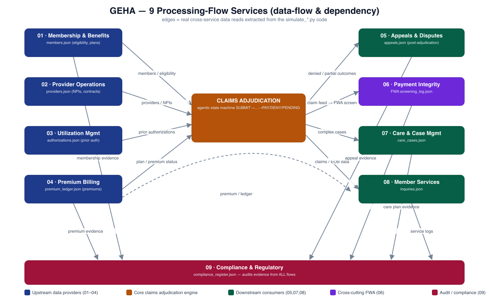
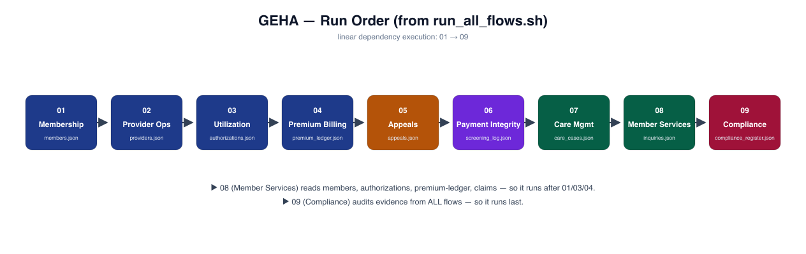
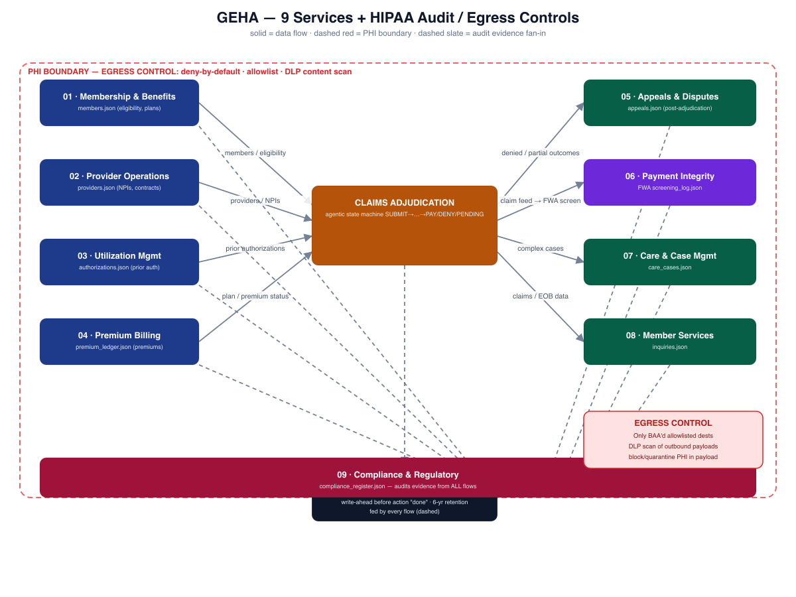

# GEHA Processing-Flow Simulations

For the local MCP interface, isolated execution, tools, and safeguards, see
[README_MCP.md](../MCP_server/README_MCP.md). Direct shell runs below still overwrite each
simulator's own outputs; MCP runs write separate `runs/run_<id>/` workspaces.

Nine directories, one per major health-payer processing flow. Each follows the
same pattern: a `functional_spec.md` (research-backed tasks/features) plus a
deterministic `simulate_*.py` that runs a simulated flow and emits JSON logs.

| # | Directory | Flow | Simulation | Spec |
|---|-----------|------|-----------|------|
| 1 | `01_membership_benefits/` | Membership & Benefits Admin | `simulate_membership.py` | `functional_spec.md` |
| 2 | `02_provider_operations/` | Provider Operations | `simulate_providers.py` | `functional_spec.md` |
| 3 | `03_utilization_management/` | Utilization Management | `simulate_utilization.py` | `functional_spec.md` |
| 4 | `04_premium_billing/` | Premium Billing & Reconciliation | `simulate_premium_billing.py` | `functional_spec.md` |
| 5 | `05_appeals_disputes/` | Post-Adjudication & Disputes | `simulate_appeals.py` | `functional_spec.md` |
| 6 | `06_payment_integrity/` | Payment Integrity / FWA | `simulate_payment_integrity.py` | `functional_spec.md` |
| 7 | `07_care_case_management/` | Care & Case Management | `simulate_care_management.py` | `functional_spec.md` |
| 8 | `08_member_services/` | Customer / Member Services | `simulate_member_services.py` | `functional_spec.md` |
| 9 | `09_compliance/` | Compliance & Regulatory | `simulate_compliance.py` | `functional_spec.md` |

## What the code actually does

Each numbered folder contains a standalone Python simulation, not an LLM agent.
The scripts use fabricated data, fixed rules, and sometimes seeded randomness.
They write JSON results and event logs.

| Folder / executable code | What it actually does |
|---|---|
| **01 Membership** — [simulate_membership.py](01_membership_benefits/simulate_membership.py) | Creates fabricated members, assigns plans and dependent counts, simulates coverage changes, and records ID-card issuance. Writes `members.json` and membership events. |
| **02 Providers** — [simulate_providers.py](02_provider_operations/simulate_providers.py) | Checks hardcoded exclusion, license, and malpractice flags; assigns network status and facilities. Writes `providers.json` and provider events. |
| **03 Utilization** — [simulate_utilization.py](03_utilization_management/simulate_utilization.py) | Uses a fixed CPT lookup and fabricated “necessity scores” to approve, deny, or flag authorization requests. Writes `authorizations.json` and UM events. |
| **04 Billing** — [simulate_premium_billing.py](04_premium_billing/simulate_premium_billing.py) | Reads membership records, calculates simulated premium shares, and generates current, past-due, or lapsed payment statuses. Writes `premium_ledger.json` and billing events. |
| **05 Appeals** — [simulate_appeals.py](05_appeals_disputes/simulate_appeals.py) | Processes predefined disputes through simulated filing deadlines, internal decisions, and external review. Writes `appeals.json` and appeal events. |
| **06 Payment integrity** — [simulate_payment_integrity.py](06_payment_integrity/simulate_payment_integrity.py) | Scores predefined claims using injected duplicate/upcoding flags, diagnosis/procedure pairs, and charge thresholds. Writes `screening_log.json` and integrity events. |
| **07 Care management** — [simulate_care_management.py](07_care_case_management/simulate_care_management.py) | Maps predefined conditions to care programs, simulates enrollment, and assigns monitoring/completed statuses. Writes `care_cases.json` and care events. |
| **08 Member services** — [simulate_member_services.py](08_member_services/simulate_member_services.py) | Processes predefined inquiries. Looks up claim, membership, and authorization statuses; other responses, such as premium balances and ID-card requests, are canned messages. Writes `inquiries.json` and service events. |
| **09 Compliance** — [simulate_compliance.py](09_compliance/simulate_compliance.py) | Mostly checks whether other flows’ output files exist and produces simulated compliance statuses. Writes `compliance_register.json` and compliance events. |

## Simulation limitations

**Important distinction:** these scripts simulate actions by updating records and
logging messages. They do not actually issue cards, collect payments, contact
reviewers, investigate fraud, or verify clinical necessity.

Some checks are placeholders—for example, the compliance script’s HIPAA check
includes `or True`, so it always passes. These outputs are **not evidence of real
regulatory compliance**.

## Run everything

[run_all_flows.sh](run_all_flows.sh) runs all nine simulations sequentially.
Run the following from the `highlevel_simulation` directory. Running these commands
overwrites the existing JSON outputs.

```bash
bash run_all_flows.sh        # or
for d in 0*/; do (cd "$d" && python simulate_*.py); done
```

## MCP response summaries

Every simulator now writes `mcp_response.json` in its own folder after writing
its detailed records and event log. Counters are computed from that run, not
from the illustrative example files. Running the simulator replaces its example
response with `example_only: false` and `simulation_only: true`.

The response contains `flow`, `execution_status`, `data_provenance`, `summary`,
and `outputs` (filenames relative to the simulator folder). Member Services and
Compliance also include warnings; Compliance sets `compliance_verified: false`.
Provider network counts include only credentialed providers, not rejected
records with a default network label. Appeal escalation counts overlap final
outcome counts.

`execution_status: completed` means the simulator reached response generation;
it does not mean all requests were approved or actual compliance was verified.
These are tool-result payloads, not JSON-RPC envelopes, and do not start an MCP
server. Console output is unchanged. Failed direct runs may leave an older
response file. The MCP wrapper checks process exit status and required outputs
before reporting success. Concurrent direct runs share output filenames; MCP
runs use isolated `runs/run_<id>/` workspaces.

To test all nine in temporary copies without changing project datasets:

```bash
python -m unittest discover -s /Users/dc/geha/highlevel_simulation -p test_responses.py
```

## Each flow's outputs

| Flow | JSON outputs |
|------|--------------|
| 1 Membership | `members.json`, `membership_events.json` |
| 2 Provider Ops | `providers.json`, `provider_events.json` |
| 3 Utilization | `authorizations.json`, `um_events.json` |
| 4 Premium Billing | `premium_ledger.json`, `billing_events.json` |
| 5 Appeals | `appeals.json`, `appeals_events.json` |
| 6 Payment Integrity | `screening_log.json`, `integrity_events.json` |
| 7 Care Management | `care_cases.json`, `care_events.json` |
| 8 Member Services | `inquiries.json`, `service_events.json` |
| 9 Compliance | `compliance_register.json`, `compliance_events.json` |

> Several flows read upstream data: **8 (Member Services)** pulls from claims,
> membership, and UM (premium responses are currently canned); **9 (Compliance)** checks for audit evidence from
> all other flows. Run them in dependency order (the script does).

## Method

For each flow: web research on GEHA + the processing area → `functional_spec.md`
with high-level tasks/features → deterministic `simulate_*.py` → JSON logs +
console summary. All member/provider/claim data is **fabricated**.

## Simulator diagrams

### Services flowchart



### Simulation run order



### HIPAA overlay



These diagrams illustrate the simulation; they do not establish real HIPAA or
regulatory compliance. See the simulation limitations above.
